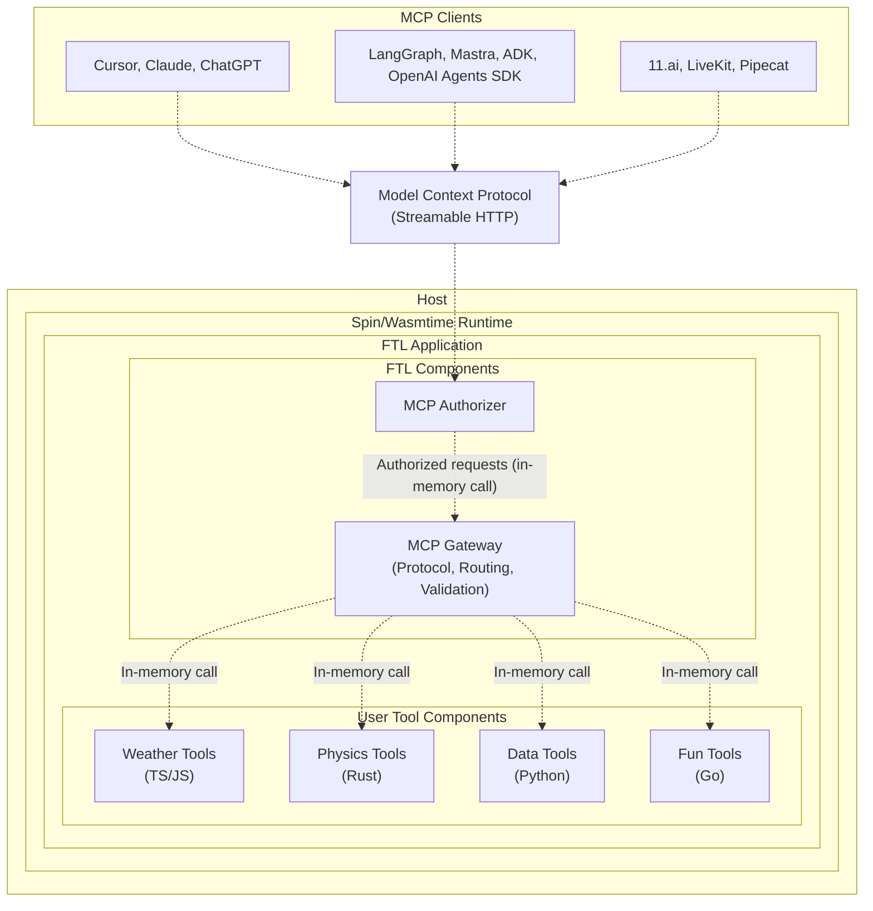

<div align="center">

# `ftl` by fastertools 

Faster tools for AI agents

[](LICENSE)
[](https://webassembly.org/)
[](https://www.rust-lang.org)
[](https://discord.gg/ByFw4eKEU7)

[Docs](./docs/README.md) | [Contributing](./CONTRIBUTING.md) | [Releases](https://github.com/fastertools/ftl-cli/releases)

⚡️ [Quick Start](#quick-start)

</div>

FTL is an open-source framework for building and running polyglot [Model Context Protocol](https://modelcontextprotocol.io)(MCP) servers. It's designed from the ground up to be fast, secure, and portable, using a modern stack of open standards.

We believe the future of AI tooling shouldn't be locked into proprietary ecosystems. FTL is our commitment to that vision, built entirely on:

- WebAssembly (WASM): For secure, sandboxed execution with sub-millisecond cold starts.
- The [Component Model](https://component-model.bytecodealliance.org/design/why-component-model.html): To compose tools written in different languages (Rust, Python, Go, TS) into a single application.
- [Spin](https://github.com/spinframework/spin): The CNCF-hosted developer tool and runtime for building and running WASM applications.

This foundation ensures that what you build with FTL today will be compatible with the open, interoperable ecosystem of tomorrow.

## Project Components

This monorepo contains everything you need to build and deploy AI tools:

- **ftl**: CLI for managing FTL applications and deployments (Go)
- **MCP Components**: Pre-built gateway and authorizer for secure MCP servers (Rust/WASM)
- **SDKs**: Multi-language support for building AI tools (Python, Rust, TypeScript, Go)
- **Templates**: Quick-start patterns for common use cases
- **Examples**: Real-world applications demonstrating best practices

## FTL vs. FTL Engine
- **ftl** (This Repo): The open-source framework and CLI for building MCP servers that can run anywhere Spin apps are supported.
- **FTL Engine**: Our optional, managed platform for deploying ftl applications to a globally distributed edge network for the simplest path to production

### Features

- **Polyglot by Design**: SDKs for Python, Rust, TypeScript, and Go let you write tools in the best language for the job.
- **Seamless Composition**: Mix and match tools written in different languages within a single MCP server.
- **Secure & Sandboxed**: Each tool runs in an isolated WASM sandbox, with no access to the host system unless explicitly granted
- **Run Anywhere**: Deploy to any host compatible with Spin/[Wasmtime](https://github.com/bytecodealliance/wasmtime).
- **MCP Compliant**: Out-of-the-box support for [Streamable HTTP](https://modelcontextprotocol.io/specification/2025-06-18/basic/transports#streamable-http) and spec-compliant [Authorization](https://modelcontextprotocol.io/specification/2025-06-18/basic/authorization)
- **Blazing Fast**: Sub-millisecond cold starts and near-native performance, powered by Wasmtime.

## Quick Start
### Prerequisites

To build tools in different languages, you'll need their corresponding toolchains:

- **Rust**: `cargo` (via [rustup](https://rustup.rs/))
- **TypeScript/JavaScript**: `node` and `npm` (via [Node.js](https://nodejs.org/))
- **Python**: `python3` and `componentize-py` (install with `pip install componentize-py`)
- **Go**: `go` and `tinygo` (via [Go](https://golang.org/) and [TinyGo](https://tinygo.org/))

### Installing and Updating 

To get `ftl` installed run the [install script](install.sh). Download and run manually or download and install with curl/wget:
```bash
curl -o- https://raw.githubusercontent.com/fastertools/ftl-cli/main/install.sh | bash
```
```bash
wget -qO- https://raw.githubusercontent.com/fastertools/ftl-cli/main/install.sh | bash
```

### Create a new project and scaafold a tool
```bash
ftl init fast-project 

cd fast 

ftl add fast-tool --language rust
```

### Run the Local Development Server
```bash
ftl up --watch

→ Starting development server with auto-rebuild...

👀 Watching for file changes

Serving http://127.0.0.1:3000
Available Routes:
  mcp: http://127.0.0.1:3000 (wildcard)
```

### Connect your MCP Client

Example mcp.json config
```json
{
  "mcpServers": {
    "fasttools": {
      "url": "http://127.0.0.1:3000",
      "transport": "http"
    }
  }
}
```

#### Add To Claude Code
```bash
claude mcp add -t http fasttools http://127.0.0.1:3000
```

## Ready to Deploy? 

### Deploying to FTL Engine

For the simplest path to a production-grade, globally-distributed deployment, you can use FTL Engine. It handles scaling, security, and distribution for you on Akamai's edge network.

First join [Discord](https://discord.gg/ByFw4eKEU7) to request early access. 

#### Log in to FTL Engine
```bash
ftl eng login
```

#### Deploy
```bash
ftl eng deploy

▶ Deploying project to FTL Engine
→ Configuring MCP authorization settings...
✓ MCP authorization set to: public
✓ Deployed!

  MCP URL: https://8e264fc0-xxxx-aaaa-9999-9f5ab760092a.fwf.app
```

## Architecture

FTL composes your individual tool components with our gateway and authorizer components into a single Spin application. All calls between components happen securely in-memory, eliminating network latency between your tools.



### Fast Anywhere in the World
<div align="center">
<em>Example: A Python text processing tool called from 5 continents</em>


</div>


### Secure by design

<details>
<summary><strong>Internal isolation and MCP-compliant authorization.</strong></summary>

Each WebAssembly module executes within a [sandboxed](https://webassembly.org/docs/security/) environment separated from the host runtime using fault isolation techniques.

A [component](https://component-model.bytecodealliance.org/design/why-component-model.html#components) is a WebAssembly binary (which may or may not contain modules) that is restricted to interact only through the modules' imported and exported functions.

Allowed outbound hosts and accessible variables can be configured per individual tool component within a server.

Out-of-the-box support for configurable [MCP-compliant authorization](https://modelcontextprotocol.io/specification/2025-06-18/basic/authorization), including
- Spec-compliant OAuth 2.1 implementation
- OAuth 2.0 Dynamic Client Registration Protocol (RFC7591).
- OAuth 2.0 Protected Resource Metadata (RFC9728).
- OAuth 2.0 Authorization Server Metadata (RFC8414).

Plug in your own JWT issuer with simple configuration.
</details>

### Edge deployments on FTL Engine
<details>
<summary><strong>FTL Engine is an end-to-end platform for running remote tools called by AI agents.</strong></summary>

Tools cold start in under half a millisecond, instantly scale up to meet demand, and scale down to zero.

Engines run on [Fermyon Wasm Functions](https://www.fermyon.com/wasm-functions) and [Akamai](https://www.akamai.com/why-akamai/global-infrastructure), the most globally distributed edge compute network.

Cost scales predictably with usage. There are no idle costs and no price variables like execution duration, region, memory, provisioned concurrency, reserved concurrency, [etc](https://aws.amazon.com/lambda/pricing/). Cold starts and init phases are architected out. Engine specs are fixed and scaling is completely horizontal and automatic.

Tools are automatically deployed across the global network edge. Tool calls are routed to an Engine running on the most optimal Akamai edge PoP, enabling consistently low latency across geographic regions.

The FTL [components](#architecture) handle MCP implementation, auth, tool call routing, and tool call argument validation.

Bring your own JWT issuer or OAuth provider via simple configuration. Or use FTL's by default.
</details>


## Contributing

We welcome contributions and discussion. Please see the [Contributing Guide](CONTRIBUTING.md) for details.

## License

Apache-2.0 - see [LICENSE](LICENSE) for details.

## Acknowledgments

FTL is built on top of these excellent projects:
- [Spin](https://github.com/fermyon/spin)
- [Model Context Protocol](https://modelcontextprotocol.io)
- [WebAssembly](https://webassembly.org)

