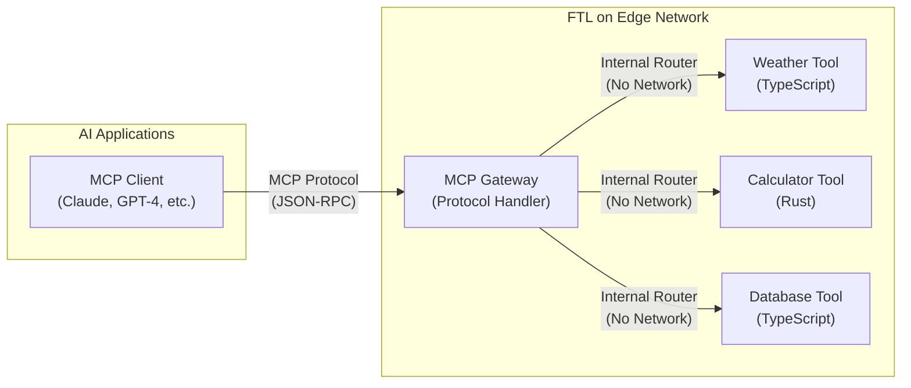

<div align="center">

# `ftl`

Fast tools for AI agents

[](https://github.com/fastertools/ftl-cli/actions/workflows/ci.yml)
[](LICENSE)
[](https://www.rust-lang.org)
[](https://webassembly.org/)

[Docs](./docs/introduction.md) | [Authentication](./docs/authentication.md) | [Contributing](./CONTRIBUTING.md) | [Security](./SECURITY.md) | [Releases](https://github.com/fastertools/ftl-cli/releases)

</div>

FTL is a platform on the network edge that makes it easy to deploy and manage secure [Model Context Protocol](https://modelcontextprotocol.io) servers with SOTA performance. It builds on the [WebAssembly Component Model](https://component-model.bytecodealliance.org/design/why-component-model.html) via [Spin](https://github.com/spinframework/spin) to provide a *just works* DX for authoring MCP tools in any source lanaguage that run natively on the [most distributed](https://www.akamai.com/why-akamai/global-infrastructure) edge network.

## Why?

When an AI agent connects to MCP tools over the network, every tool call produces latency. For agents deployed in realtime and other performance sensitive applications, that latency adds up to impact the behavior of the whole system. FTL solves this problem by providing:

- **Sub-millisecond cold starts on global edge compute**: Backed by [Fermyon Wasm Functions](https://www.fermyon.com/wasm-functions) running on Akamai's globally distributed edge network. Agents deployed anywhere can instanly access their networked tools with almost no latency.
- **Mix source languages within one MCP server**: Write your MCP tools in Rust, TypeScript, Python, Go, C, and [more](https://component-model.bytecodealliance.org/language-support.html). If you can implement a basic HTTP route as a Wasm component, you can run it as an MCP tool with FTL.
- **Tiny artifacts, fast deployments**: WebAssembly binaries are self-contained and often < 1MB vs. 100MB+ containers.
- **Secure by Default**: WebAssembly provides sandboxed tool executions on a provably airtight [security model](https://webassembly.org/docs/security/).
- **Deploy Anywhere**: While FTL provides a managed platform optimized for MCP workloads and management, you can run your FTL-produced wasm components on Fermyon directly, or on Kubernetes, Wasmtime, or any WASI-compatible runtime, including your own computer or Docker Desktop.

## Quick Start

```bash
# Install FTL
cargo install ftl-cli

# Set up templates
ftl setup templates

# Create a new project
ftl init my-project

# Authenticate with FTL (see docs/authentication.md for details)
ftl login
```

## Creating tools

<details>
<summary><strong>🦀 Rust example</strong></summary>

Add a Rust tool to a project
```bash
cd my-project
ftl add my-tool --language rust
```

```rust
// my-tool/src/lib.rs

use ftl_sdk::{tool, ToolResponse};
use serde::Deserialize;
use schemars::JsonSchema;

#[derive(Deserialize, JsonSchema)]
struct MyToolInput {
    /// The message to process
    message: String,
}

/// A simple MCP tool
#[tool]
fn my_tool(input: MyToolInput) -> ToolResponse {
    ToolResponse::text(format!("Processed: {}", input.message))
}
```
</details>

<details>
<summary><strong>🟦 TypeScript example</strong></summary>

Add a TypeScript tool to a project
```bash
ftl add my-tool --language typescript
```

```typescript
// my-tool/src/index.ts

import { createTool, ToolResponse } from 'ftl-sdk'
import { z } from 'zod'

// Define the schema using Zod
const ToolSchema = z.object({
  message: z.string().describe('The message to process')
})

type ToolInput = z.infer<typeof ToolSchema>

const tool = createTool<ToolInput>({
  metadata: {
    name: 'my_tool',
    title: 'My Tool',
    description: 'A simple MCP tool',
    inputSchema: z.toJSONSchema(ToolSchema)
  },
  handler: async (input) => {
    return ToolResponse.text(`Processed: ${input.message}`)
  }
})

//@ts-ignore
addEventListener('fetch', (event: FetchEvent) => {
  event.respondWith(tool(event.request))
})
```
</details>

### Workflow

### 1. Develop
```bash
# From project root (with spin.toml)
ftl build           # Build all tools
ftl test            # Run tests
ftl watch           # Auto-rebuild on changes
ftl up              # Run the MCP server
```

### 2. Plug in to your local MCP Client Configuration
```json
{
  "mcpServers": {
    "my-assistant": {
      "url": "http://127.0.0.1:3000/mcp",
      "transport": "http"
    }
  }
}
```

### 3. Deploy
```bash
ftl deploy
```

## Architecture

FTL leverages the ftl-mcp framework and Spin platform to create a highly optimized MCP server runtime:



**Key Architecture Points:**
- Each tool is a separate WebAssembly component with its own sandbox
- The MCP Gateway handles all protocol complexity and routing
- Tools communicate via Spin's internal router (no network latency)
- Deploy to edge locations globally for minimal latency to AI agents

## Contributing

We welcome contributions and discussion. Please see our [Contributing Guide](CONTRIBUTING.md) for details.

## License

Apache-2.0 - see [LICENSE](LICENSE) for details.

## Acknowledgments

FTL is built on top of these excellent projects:
- [Fermyon Spin](https://github.com/fermyon/spin)
- [Model Context Protocol](https://modelcontextprotocol.io)
- [WebAssembly](https://webassembly.org)
