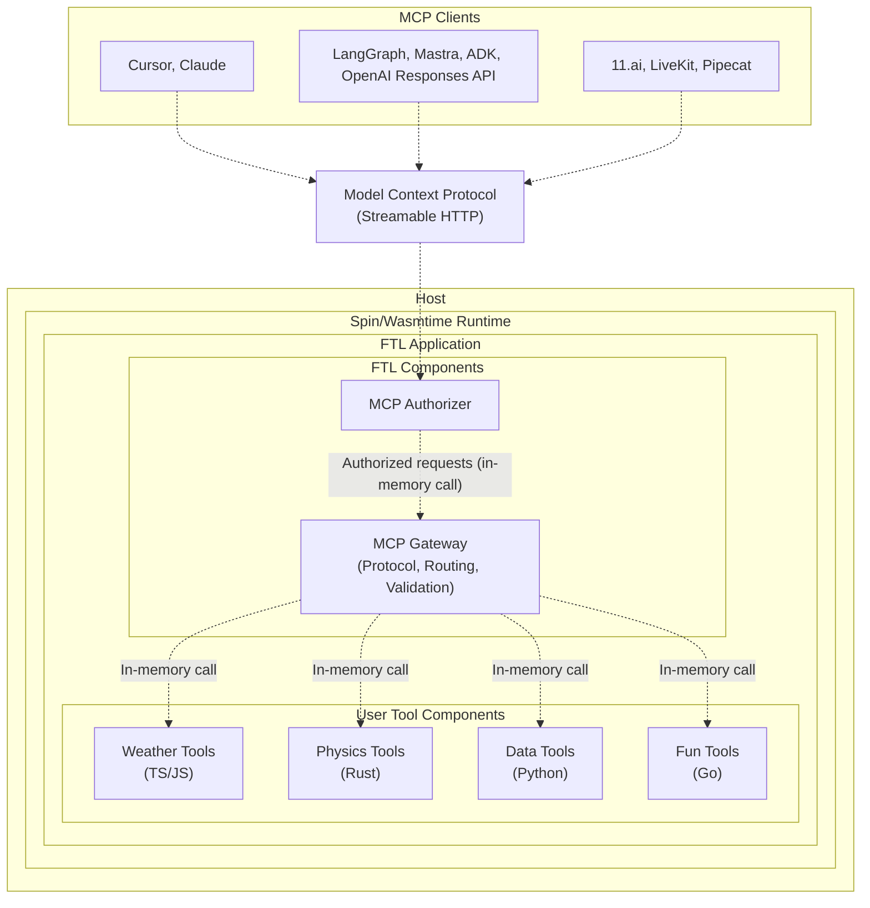

<div align="center">

# `ftl`

Faster tools for AI agents

[](LICENSE)
[](https://webassembly.org/)
[](https://www.rust-lang.org)
[](https://discord.gg/ByFw4eKEU7)

[Docs](./docs/README.md) | [Contributing](./CONTRIBUTING.md) | [Releases](https://github.com/fastertools/ftl-cli/releases)

⚡️ [Quick Start](#quick-start)

</div>

FTL is a framework to write and run polyglot [Model Context Protocol](https://modelcontextprotocol.io) servers on [WebAssembly components](https://component-model.bytecodealliance.org/design/why-component-model.html) via [Spin](https://github.com/spinframework/spin).

Tools authored in multiple [source languages](./sdk/README.md) can run simultaneously in a single MCP server process on any host compatible with Spin/[Wasmtime](https://github.com/bytecodealliance/wasmtime), including your development machine.

FTL Engine is a new agent tool platform powered by [Fermyon Wasm Functions](https://www.fermyon.com/wasm-functions) and [Akamai](https://www.akamai.com/why-akamai/global-infrastructure)'s globally distributed edge compute network. It aims to be a complete surface for deploying and running lag-free remote MCP servers with sub-millisecond cold starts and consistently low latency across geographic regions. Talk to us on [Discord](https://discord.gg/ByFw4eKEU7) to request early access.

## Why?

<details>
<summary><strong>⤵ Simple tool DX across languages</strong></summary>

* <details>
  <summary><strong>🦀 Rust</strong></summary>

  ```rust
  use ftl_sdk::{tools, text, ToolResponse};
  use serde::Deserialize;
  use schemars::JsonSchema;

  #[derive(Deserialize, JsonSchema)]
  struct ProcessInput {
      /// The message to process
      message: String,
  }

  tools! {
      /// Process a message
      fn process_message(input: ProcessInput) -> ToolResponse {
          text!("Processed: {}", input.message)
      }
      
      /// Reverse a string
      fn reverse_text(input: ProcessInput) -> ToolResponse {
          let reversed: String = input.message.chars().rev().collect();
          text!("{}", reversed)
      }
  }
  ```
  </details>

* <details>
  <summary><strong>🟦 TypeScript</strong></summary>

  ```typescript
  import { createTools, ToolResponse } from 'ftl-sdk'
  import { z } from 'zod'

  // Define schemas using Zod
  const ProcessSchema = z.object({
    message: z.string().describe('The message to process')
  })

  const ReverseSchema = z.object({
    text: z.string().describe('The text to reverse')
  })

  const handle = createTools({
    processMessage: {
      description: 'Process a message',
      inputSchema: z.toJSONSchema(ProcessSchema),
      handler: async (input: z.infer<typeof ProcessSchema>) => {
        return ToolResponse.text(`Processed: ${input.message}`)
      }
    },
    reverseText: {
      description: 'Reverse a string',
      inputSchema: z.toJSONSchema(ReverseSchema),
      handler: async (input: z.infer<typeof ReverseSchema>) => {
        const reversed = input.text.split('').reverse().join('')
        return ToolResponse.text(reversed)
      }
    }
  })

  //@ts-ignore
  addEventListener('fetch', (event: FetchEvent) => {
    event.respondWith(handle(event.request))
  })
  ```
  </details>

- Write tools in TypeScript, Rust, Python, Go, and [more](https://component-model.bytecodealliance.org/language-support.html). Tools are organized into tool components, which serve as isolated and distributable units.
- Combine tool components from different source languages onto a single sandboxed MCP server process that exposes an `/mcp` Streamable HTTP endpoint. See [Architecture](#architecture) for details.
- Tool components can be distributed on OCI registries like Docker Hub and GitHub Container Registry.
- High performance features like [SIMD](https://github.com/WebAssembly/spec/blob/main/proposals/simd/SIMD.md) are available in supported languages like Rust and C.
</details>

<details>
<summary><strong>⤵ Secure by design</strong></summary>

- Tool components within the sandboxed server process are themselves [individually isolated](https://component-model.bytecodealliance.org/design/why-component-model.html#benefits-of-the-component-model) and can each expose multiple tools.
- Allowed outbound hosts and accessible variables can be configured per individual tool component within a server.
- MCP endpoints are secured by configurable [protocol-compliant authorization](https://modelcontextprotocol.io/specification/2025-06-18/basic/authorization).
- Plug in your own JWT issuer or OIDC provider with simple configuration.
</details>

<details>
<summary><strong>⤵ Distribute and compose tools like lightweight docker images</strong></summary>

- Tools are compiled to self-contained Wasm binaries that are often < 1MB.
- Tools can be pushed and pulled directly from [OCI](https://opencontainers.org/)-compliant registries like Docker Hub, GitHub Container Registry, Amazon Elastic Container Registry, and more.
- Mix and match individual tools in your MCP server by registry URI. Allowed outbound network calls are configurable per tool.
</details>

<details>
<summary><strong>⤵ Edge deployments on FTL Engine</strong></summary>

FTL Engine is an end-to-end platform for running remote tools called by AI agents. Tools deployed on FTL engines are powerful enough to do meaningful work themselves and snappy enough to serve as fast proxies to other servers. Engines run on [Fermyon Wasm Functions](https://www.fermyon.com/wasm-functions) and [Akamai](https://www.akamai.com/why-akamai/global-infrastructure), the most globally distributed edge compute network.

- Tools cold start in under half a millisecond, automatically scale up to meet demand, and scale down to zero.
- Cost scales simply and predictably with invocations. There are no idle costs and no price variables like execution duration, region, memory, provisioned concurrency, reserved concurrency, [etc](https://aws.amazon.com/lambda/pricing/). Cold starts and init phases are architected out of the problem. Engine specs are fixed and scaling is completely horizontal and automatic.
- Tools are automatically deployed across the global network edge. Tool calls are routed to an Engine running on the most optimal Akamai edge PoP, enabling consistently low latency across geographic regions.
- Tool components are securely isolated within Engines, which are sandboxed themselves.
- The FTL [components](#architecture) handle MCP implementation, auth, tool call routing, and tool call argument validation.
- High-performance programming patterns with low-level features like [SIMD](https://github.com/WebAssembly/spec/blob/main/proposals/simd/SIMD.md) are available in languages like Rust and C to unlock SOTA compute capabilities for real-time agents. Hashing, parsing, and other deterministic compute-bound operations for agents can be implemented performantly by the tool itself.
- Bring your own JWT issuer or OIDC provider via simple configuration. Or use FTL's by default.

FTL Engine is just one possible deployment target. It is currently in early alpha with limited capacity. Run the `ftl eng login` command to join the waitlist.
</details>

## Prerequisites

To build tools in different languages, you'll need the corresponding toolchains:

- **Rust**: `cargo` (via [rustup](https://rustup.rs/))
- **TypeScript/JavaScript**: `node` and `npm` (via [Node.js](https://nodejs.org/))
- **Python**: `python3` and `componentize-py` (install with `pip install componentize-py`)
- **Go**: `go` and `tinygo` (via [Go](https://golang.org/) and [TinyGo](https://tinygo.org/))

## Quick Start

Install `ftl`
```bash
curl -fsSL https://$(gh auth token)@raw.githubusercontent.com/fastertools/ftl-cli/main/install.sh | bash
```

Create a new project
```bash
ftl init faster-tools && cd faster-tools
```

Scaffold tools
```bash
ftl add
```

Develop and serve locally
```bash
ftl up --watch
```

Try it out with your MCP client
```json
{
  "mcpServers": {
    "fastTools": {
      "url": "http://127.0.0.1:3000/mcp",
      "transport": "http"
    }
  }
}
```
```bash
claude mcp add -t http faster-tools http://127.0.0.1:3000/mcp
```

### Ready to deploy?

Join [Discord](https://discord.gg/ByFw4eKEU7) to request access.

Log in to FTL Engine
```bash
ftl eng login
```

Deploy
```bash
ftl eng deploy
```

Plug it in
```json
{
  "mcpServers": {
    "fasterTools": {
      "url": "https://d2c85b78-6487-4bee-a98c-5fa32f1598af.aka.fermyon.tech/mcp",
      "transport": "http"
    }
  }
}
```
```bash
claude mcp add -t http faster-tools https://d2c85b78-6487-4bee-a98c-5fa32f1598af.aka.fermyon.tech/mcp
```

## Architecture



- Tool components are individually isolated WebAssembly components with their own sandboxes.
- Tool components are composed together with the FTL gateway components and run as a single MCP server process on the host.
- The FTL gateway components handle protocol complexity, auth, tool argument validation, and tool component routing.
- Cross-component calls happen in memory with no network latency, while maintaining secure boundaries.

## Contributing

We welcome contributions and discussion. Please see the [Contributing Guide](CONTRIBUTING.md) for details.

## License

Apache-2.0 - see [LICENSE](LICENSE) for details.

## Acknowledgments

FTL is built on top of these excellent projects:
- [Spin](https://github.com/fermyon/spin)
- [Model Context Protocol](https://modelcontextprotocol.io)
- [WebAssembly](https://webassembly.org)
