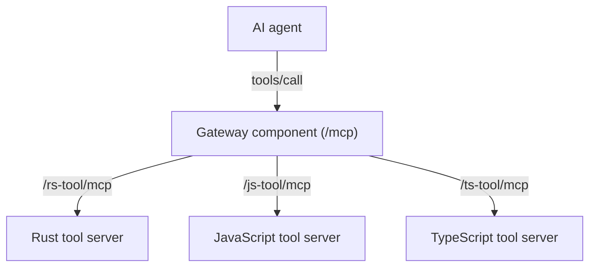

<div align="center">

# `ftl`

Fast tools for AI agents

[](https://github.com/fastertools/core/actions/workflows/ci.yml)
[](LICENSE)
[](https://www.rust-lang.org)
[](https://webassembly.org/)

[Docs](./docs/introduction.md) | [Contributing](./CONTRIBUTING.md) | [Security](./SECURITY.md) | [Releases](https://github.com/fastertools/ftl-cli/releases)

</div>

FTL is a platform for developing and deploying fast, edge-hosted [Model Context Protocol](https://modelcontextprotocol.io/introduction) tools for AI agents.

This repository contains the `ftl` command-line interface, which is the primary entry point.

## Getting Started

### Installation

```bash
cargo install ftl-cli
```

FTL requires Spin v3.3.1 to run WebAssembly tools. FTL manages its own Spin installation in `~/.ftl/bin` to ensure version compatibility. This won't affect any system-wide Spin installations you may have.

- When you first use FTL, it will prompt to install Spin (even if you have Spin installed system-wide)
- Set `FTL_AUTO_INSTALL=true` to skip the prompt
- Manually manage FTL's Spin with `ftl spin` commands:
  - `ftl spin install` - Install Spin v3.3.1 in ~/.ftl/bin
  - `ftl spin update` - Update to the latest supported version
  - `ftl spin remove` - Remove FTL-managed Spin
  - `ftl spin info` - Show installation details

### Create a New Tool

<details>
<summary><b>🦀 Rust</b></summary>

```bash
ftl new my-tool --rust
```

This creates a new directory with:
- `ftl.toml` - Tool manifest
- `Cargo.toml` - Rust dependencies
- `src/lib.rs` - Tool implementation

```rust
use ftl_sdk_rs::prelude::*;

#[derive(Clone)]
struct MyTool;

impl Tool for MyTool {
    fn name(&self) -> &'static str { "my-tool" }
    fn description(&self) -> &'static str { "My tool description" }
    
    fn input_schema(&self) -> serde_json::Value {
        json!({
            "type": "object",
            "properties": {
                "input": {"type": "string"}
            },
            "required": ["input"]
        })
    }
    
    fn call(&self, args: &serde_json::Value) -> Result<ToolResult, ToolError> {
        let input = args["input"].as_str()
            .ok_or(ToolError::InvalidArguments("input required".into()))?;
            
        Ok(ToolResult::text(format!("Processed: {}", input)))
    }
}

ftl_sdk_rs::ftl_mcp_server!(MyTool);
```
</details>

<details>
<summary><b>🔷 TypeScript</b></summary>

```bash
ftl new my-tool --typescript
```

This creates a new directory with:
- `ftl.toml` - Tool manifest
- `package.json` - Node dependencies
- `tsconfig.json` - TypeScript configuration
- `src/index.ts` - Tool implementation

```typescript
import { Tool, ToolResult, ToolError } from '@fastertools/ftl-sdk-ts';

export default class MyTool extends Tool {
    get name(): string { return 'my-tool'; }
    get description(): string { return 'My tool description'; }
    
    get inputSchema() {
        return {
            type: 'object',
            properties: {
                input: { type: 'string' }
            },
            required: ['input']
        };
    }
    
    execute(args: { input: string }): ToolResult {
        const { input } = args;
        
        if (!input) {
            throw ToolError.invalidArguments('input required');
        }
        
        return ToolResult.text(`Processed: ${input}`);
    }
}
```

</details>

</details>

<details>
<summary><b>🟨 JavaScript</b></summary>

```bash
ftl new my-tool --javascript
```

This creates a new directory with:
- `ftl.toml` - Tool manifest
- `package.json` - Node dependencies
- `src/index.js` - Tool implementation

```javascript
import { Tool, ToolResult, ToolError } from '@fastertools/ftl-sdk-ts';

export default class MyTool extends Tool {
    get name() { return 'my-tool'; }
    get description() { return 'My tool description'; }
    
    get inputSchema() {
        return {
            type: 'object',
            properties: {
                input: { type: 'string' }
            },
            required: ['input']
        };
    }
    
    execute(args) {
        const { input } = args;
        
        if (!input) {
            throw ToolError.invalidArguments('input required');
        }
        
        return ToolResult.text(`Processed: ${input}`);
    }
}
```

</details>

### Serve Locally

```bash
ftl serve
```

This will start a local development server with hot reloading. You can test your tool by sending it a JSON-RPC request:

```bash
curl -X POST http://localhost:3000/mcp \
  -H "Content-Type: application/json" \
  -d '{"jsonrpc":"2.0","method":"tools/call","params":{"name":"my-tool","arguments":{"input":"test"}},"id":1}'
```

Each FTL tool is a complete MCP server that exposes a single tool. When you deploy an individual tool, you're deploying a standalone MCP server. Toolkits (described below) bundle multiple tools together with a gateway that acts as a unified MCP server over multiple tools.

### Deploy to FTL Edge

```bash
ftl deploy
```

This will deploy your tool to FTL Edge, where it can be called by your AI agents.

## Toolkits

FTL supports bundling multiple tools together as a toolkit, providing a powerful way to create comprehensive agent capabilities. Toolkits leverage the WebAssembly component model to enable secure, high-performance composition of tools.

### Architecture

Each FTL tool is a self-contained WebAssembly component that implements its own MCP server exposing a single tool. Toolkits take this further by:

- **Component Composition**: Multiple WebAssembly components (tools) are bundled together using the component model.
- **Automatic Gateway**: FTL generates a gateway component that acts as a logical MCP server over each tool in the toolkit. The hop between the gateway component and the tool component happens fast, in memory.
- **Language Agnostic**: Each tool can be written in a different language (Rust, JavaScript, etc.), allowing you to mix languages within a single toolkit / MCP server.
- **Fast Tool Chaining**: Tools within a toolkit can be chained directly via instant in-memory calls.
- **Local Development**: Toolkits work seamlessly both locally and when deployed to the edge.

### How It Works



The gateway component:
- Exposes a Streamable HTTP /mcp endpoint that exposes an MCP server over all individual tool components
- Routes `tools/call` requests to the appropriate tool component
- Maintains protocol compatibility across all tools
- The request is passed from the gateway component to the tool in memory without leaving the host process. This is fast.

### Create a Toolkit

```bash
# Build individual tools (can be different languages)
ftl new rust-analyzer    # Rust tool
ftl new js-formatter     # JavaScript tool  
ftl new ts-linter        # TypeScript tool
ftl new data-processor   # Another Rust tool

# Bundle them as a toolkit
ftl toolkit build --name dev-toolkit rust-analyzer js-formatter ts-linter data-processor
```

### Serve a Toolkit Locally

```bash
ftl toolkit serve dev-toolkit
```

This starts a local server with:
- `/mcp` - Unified endpoint that aggregates all tools
- `/rust-analyzer/mcp` - Direct access to individual tool
- `/js-formatter/mcp` - Direct access to individual tool
- `/ts-linter/mcp` - Direct access to individual tool
- `/data-processor/mcp` - Direct access to individual tool

### Deploy a Toolkit

```bash
ftl toolkit deploy dev-toolkit
```

### Benefits

- **Single Integration Point**: AI agents connect to one MCP endpoint to access all tools
- **Mixed Language Support**: Combine Rust tools for performance-critical operations with JavaScript/TypeScript tools for rapid development
- **Component Isolation**: Each tool runs in its own sandboxed WebAssembly module
- **Local-First Development**: Test complete toolkits locally before deployment
- **Dynamic Composition**: Add or remove tools without changing agent configurations

## Documentation

For more detailed documentation, please see the [docs](./docs/introduction.md) directory in this repository.

## Development

### Running CI Checks Locally

Before pushing changes, you can run the same checks that CI runs:

```bash
# Run all CI checks
./scripts/ci-local.sh

# Or run individual checks
cargo fmt-check    # Check formatting
cargo lint         # Run clippy with CI settings
cargo test-all     # Run all tests
```

### Cargo Aliases

The project includes helpful cargo aliases in `.cargo/config.toml`:

```bash
cargo fix-fmt      # Auto-fix formatting
cargo fix-clippy   # Auto-fix clippy warnings
cargo build-wasm   # Build the SDK for WASM target
```

## Contributing

Contributions are welcome! Please see our [Contributing Guide](CONTRIBUTING.md) for more information.

## License

This project is licensed under the Apache-2.0 License.
