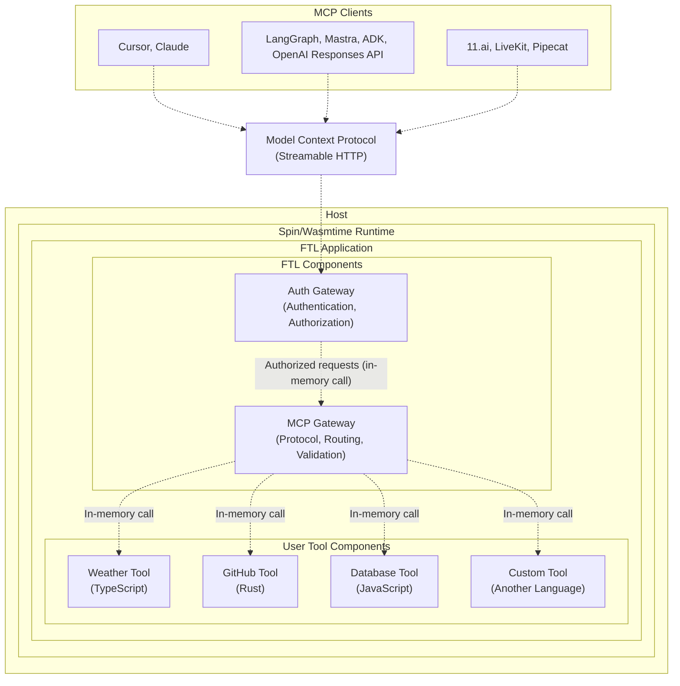

<div align="center">

# `ftl`

Fast tools for AI agents

[](LICENSE)
[](https://www.rust-lang.org)
[](https://webassembly.org/)

[Docs](./docs/README.md) | [Contributing](./CONTRIBUTING.md) | [Security](./SECURITY.md) | [Releases](https://github.com/fastertools/ftl-cli/releases)

⚡️ [Quick Start](#quick-start)

</div>

FTL is an open source tool framework for AI agents. It builds on the [WebAssembly Component Model](https://component-model.bytecodealliance.org/design/why-component-model.html) via [Spin](https://github.com/spinframework/spin) to present a *just works* DX for the whole development cycle of writing and running [Model Context Protocol](https://modelcontextprotocol.io) servers that are secure, deployable, and performant.

FTL tools can be authored in multiple [source languages](https://component-model.bytecodealliance.org/language-support.html) and run on any host compatible with Spin/[Wasmtime](https://github.com/bytecodealliance/wasmtime), including your development machine.

The FTL Platform aims to be a complete surface for deploying and managing remote MCP tools, with sub-millisecond cold starts on globally distributed [Akamai](https://www.akamai.com/why-akamai/global-infrastructure) edge compute via [Fermyon Wasm Functions](https://www.fermyon.com/wasm-functions).

## Why?

<details>
<summary><strong>⤵ Secure by design</strong></summary>

- Tools run as individual WebAssembly components within one process to enable sandboxed tool executions by default on a provably airtight [security model](https://webassembly.org/docs/security/).
- MCP endpoints are secured by configurable [protocol-compliant authorization](https://modelcontextprotocol.io/specification/2025-06-18/basic/authorization).
- Plug in your own JWT issuer or OIDC provider with simple configuration.
- Allowed outbound network calls are configurable per tool. This is especially useful when including third party tool components in your MCP server (see below).
</details>

<details>
<summary><strong>⤵ Distribute and compose tools like lightweight docker images</strong></summary>

- Tools are compiled to self-contained Wasm binaries that are often < 1MB.
- Tools can be pushed and pulled directly from [OCI](https://opencontainers.org/)-compliant registries like Docker Hub, GitHub Container Registry, Amazon Elastic Container Registry, and more.
- Mix and match individual tools in your MCP server by registry URI. Allowed outbound network calls are configurable per tool.
</details>

<details>
<summary><strong>⤵ Write tools in the best source language for the job</strong></summary>

- Combine tools written in different source languages within one MCP server.
- Use Rust, TypeScript, Python, Go, C, and [more](https://component-model.bytecodealliance.org/language-support.html).
- High performance features like [SIMD](https://github.com/WebAssembly/spec/blob/main/proposals/simd/SIMD.md) are available in languages like Rust and C.
- Tool binary size and performance are influenced by the tool's source language.
</details>

<details>
<summary><strong>⤵ Deploy on the FTL Platform</strong></summary>

Latency and compute overhead for remote tool calls should not be something you have to design AI systems around. Globally distributed high-performance compute should be accessible to agents as a resource, instantly. This enables powerful patterns for crafting optimal agent interactions and tool responses beyond just proxying to third party APIs.

- Workers automatically scale horizontally to meet demand, can cold start in < 1ms, and scale down to zero.
- FTL tools run as individually sandboxed components on [Fermyon Wasm Functions](https://www.fermyon.com/wasm-functions) and [Akamai](https://www.akamai.com/why-akamai/global-infrastructure)'s globally distributed edge cloud.
- The FTL [gateway components](#architecture) handle MCP server implementation, auth, tool argument validation, and tool component routing.
- Tool calls are automatically routed to a worker running on most optimal Akamai edge PoP, enabling consistently low latency across geographic regions.
- High performance programming patterns with low-level features like [SIMD](https://github.com/WebAssembly/spec/blob/main/proposals/simd/SIMD.md) are available via languages like Rust and C to unlock SOTA compute capabilities for real-time agents.
- Bring your own JWT issuer or OIDC provider via simple configuration. Or use FTL's by default.

The FTL Platform is just one possible deployment target. It is currently in early alpha and free with limited capacity. Opt in with the `ftl login` command, which enables `ftl deploy`.
</details>

## Quick Start

Install `ftl`
```bash
cargo install ftl-cli
```

Set up templates
```bash
ftl setup templates
```

Create a new project
```bash
ftl init my-tools
cd my-tools
```

Develop new tools
```bash
ftl add
```

Serve your tools locally
```bash
ftl up --build
```

Try them out with your MCP client
```json
{
  "mcpServers": {
    "my-tools": {
      "url": "http://127.0.0.1:3000/mcp",
      "transport": "http"
    }
  }
}
```

Authenticate with FTL
```bash
ftl login
```

Deploy
```bash
ftl deploy
```

Plug it in
```json
{
  "mcpServers": {
    "my-tools": {
      "url": "https://d2c85b78-6487-4bee-a98c-5fa32f1598af.aka.fermyon.tech/mcp",
      "transport": "https"
    }
  }
}
```

## Developing tools

<details>
<summary><strong>🦀 Rust</strong></summary>

```rust
use ftl_sdk::{tool, ToolResponse};
use serde::Deserialize;
use schemars::JsonSchema;

#[derive(Deserialize, JsonSchema)]
struct MyToolInput {
    /// The message to process
    message: String,
}

/// A simple MCP tool
#[tool]
fn my_tool(input: MyToolInput) -> ToolResponse {
    ToolResponse::text(format!("Processed: {}", input.message))
}
```
</details>

<details>
<summary><strong>🟦 TypeScript</strong></summary>

```typescript
import { createTool, ToolResponse } from 'ftl-sdk'
import { z } from 'zod'

// Define the schema using Zod
const ToolSchema = z.object({
  message: z.string().describe('The message to process')
})

type ToolInput = z.infer<typeof ToolSchema>

const tool = createTool<ToolInput>({
  metadata: {
    name: 'my_tool',
    title: 'My Tool',
    description: 'A simple MCP tool',
    inputSchema: z.toJSONSchema(ToolSchema)
  },
  handler: async (input) => {
    return ToolResponse.text(`Processed: ${input.message}`)
  }
})

//@ts-ignore
addEventListener('fetch', (event: FetchEvent) => {
  event.respondWith(tool(event.request))
})
```
</details>

## Architecture



- Each tool runs as a separate WebAssembly component in its own sandbox. Tool components are composed together with the FTL components and run as a single process while maintaining security boundaries.
- The FTL gateway components handle protocol complexity, auth, tool argument validation, and tool component routing.
- Individual components are composed onto a single worker that exposes a secure, protocol-compliant MCP server.
- Workers automatically scale horizontally to meet demand, can cold start in < 1ms, and scale down to zero.
- Cross-component calls happen in memory with no network latency, while maintaining security boundaries.
- The FTL Wasm components and language SDKs are managed in [ftl-mcp](https://github.com/fastertools/ftl-mcp).

## Contributing

We welcome contributions and discussion. Please see our [Contributing Guide](CONTRIBUTING.md) for details.

## License

Apache-2.0 - see [LICENSE](LICENSE) for details.

## Acknowledgments

FTL is built on top of these excellent projects:
- [Spin](https://github.com/fermyon/spin)
- [Model Context Protocol](https://modelcontextprotocol.io)
- [WebAssembly](https://webassembly.org)
