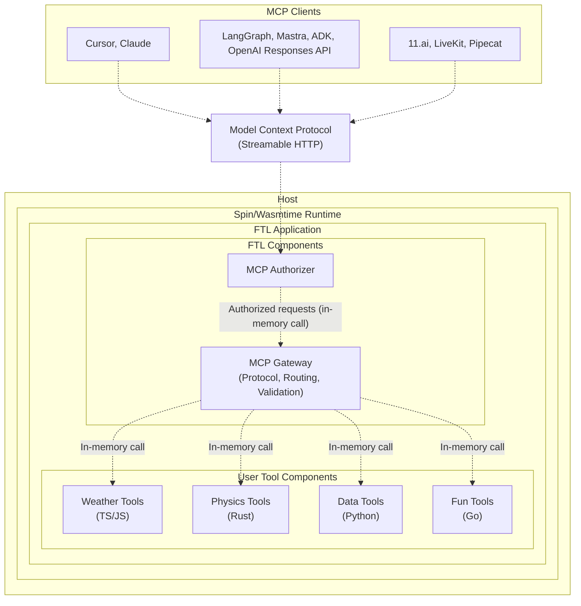

<div align="center">

# `ftl`

Fast tools for AI agents

[](LICENSE)
[](https://webassembly.org/)
[](https://www.rust-lang.org)
[](https://discord.gg/Z9S5KuVD)

[Docs](./docs/README.md) | [Contributing](./CONTRIBUTING.md) | [Releases](https://github.com/fastertools/ftl-cli/releases)

⚡️ [Quick Start](#quick-start)

</div>

FTL is an open source tool framework for AI agents. It composes [WebAssembly components](https://component-model.bytecodealliance.org/design/why-component-model.html) with [Spin](https://github.com/spinframework/spin) to present a *just works* story for writing and running [Model Context Protocol](https://modelcontextprotocol.io) servers that are secure, deployable, and performant.

FTL tools can be authored in multiple [source languages](./sdk/README.md) and run on any host compatible with Spin/[Wasmtime](https://github.com/bytecodealliance/wasmtime), including your development machine.

FTL Edge is an early platform that aims to be a complete surface for deploying and managing remote MCP tools, with sub-millisecond cold starts on globally distributed [Akamai](https://www.akamai.com/why-akamai/global-infrastructure) edge compute via [Fermyon Wasm Functions](https://www.fermyon.com/wasm-functions). Run `ftl login` to join the waitlist.

## Why?

<details>
<summary><strong>⤵ Simple across languages</strong></summary>

* <details>
  <summary><strong>🦀 Rust</strong></summary>

  ```rust
  use ftl_sdk::{tools, text, ToolResponse};
  use serde::Deserialize;
  use schemars::JsonSchema;

  #[derive(Deserialize, JsonSchema)]
  struct ProcessInput {
      /// The message to process
      message: String,
  }

  tools! {
      /// Process a message
      fn process_message(input: ProcessInput) -> ToolResponse {
          text!("Processed: {}", input.message)
      }
      
      /// Reverse a string
      fn reverse_text(input: ProcessInput) -> ToolResponse {
          let reversed: String = input.message.chars().rev().collect();
          text!("{}", reversed)
      }
  }
  ```
  </details>

* <details>
  <summary><strong>🟦 TypeScript</strong></summary>

  ```typescript
  import { createTools, ToolResponse } from 'ftl-sdk'
  import { z } from 'zod'

  // Define schemas using Zod
  const ProcessSchema = z.object({
    message: z.string().describe('The message to process')
  })

  const ReverseSchema = z.object({
    text: z.string().describe('The text to reverse')
  })

  const handle = createTools({
    processMessage: {
      description: 'Process a message',
      inputSchema: z.toJSONSchema(ProcessSchema),
      handler: async (input: z.infer<typeof ProcessSchema>) => {
        return ToolResponse.text(`Processed: ${input.message}`)
      }
    },
    reverseText: {
      description: 'Reverse a string',
      inputSchema: z.toJSONSchema(ReverseSchema),
      handler: async (input: z.infer<typeof ReverseSchema>) => {
        const reversed = input.text.split('').reverse().join('')
        return ToolResponse.text(reversed)
      }
    }
  })

  //@ts-ignore
  addEventListener('fetch', (event: FetchEvent) => {
    event.respondWith(handle(event.request))
  })
  ```
  </details>

- Mix and serve tool components written in different source languages, each with multiple tools, all exposed on one `/mcp` endpoint.
- Write tools in TypeScript, Rust, Python, Go, and [more](https://component-model.bytecodealliance.org/language-support.html).
- Tool components can be distributed on and imported from OCI registries. See below.
- High performance features like [SIMD](https://github.com/WebAssembly/spec/blob/main/proposals/simd/SIMD.md) are available in supported languages like Rust and C.
- Tool component binary size and performance are influenced by source language.
</details>

<details>
<summary><strong>⤵ Secure by design</strong></summary>

- Tools run in WebAssembly components to enable sandboxed tool executions by default on a provably airtight [security model](https://webassembly.org/docs/security/).
- MCP endpoints are secured by configurable [protocol-compliant authorization](https://modelcontextprotocol.io/specification/2025-06-18/basic/authorization).
- Plug in your own JWT issuer or OIDC provider with simple configuration.
- Allowed outbound network calls are configurable per tool. This is especially useful when including third party tool components in your MCP server (see below).
</details>

<details>
<summary><strong>⤵ Distribute and compose tools like lightweight docker images</strong></summary>

- Tools are compiled to self-contained Wasm binaries that are often < 1MB.
- Tools can be pushed and pulled directly from [OCI](https://opencontainers.org/)-compliant registries like Docker Hub, GitHub Container Registry, Amazon Elastic Container Registry, and more.
- Mix and match individual tools in your MCP server by registry URI. Allowed outbound network calls are configurable per tool.
</details>

<details>
<summary><strong>⤵ Deploy on FTL Edge</strong></summary>

Latency and compute overhead for remote tool calls should not be something you have to design AI systems around. Globally distributed high-performance compute should be accessible to agents as a resource, instantly. This enables you to do more with MCP than just proxy to a REST API.

- Workers automatically scale horizontally to meet demand, can cold start in < 1ms, and scale down to zero.
- FTL tools run as sandboxed components on [Fermyon Wasm Functions](https://www.fermyon.com/wasm-functions) and [Akamai](https://www.akamai.com/why-akamai/global-infrastructure)'s globally distributed edge cloud.
- The FTL [components](#architecture) handle MCP server implementation, auth, tool argument validation, and tool component routing.
- Tool calls are automatically routed to a worker running on most optimal Akamai edge PoP, enabling consistently low latency across geographic regions.
- High performance programming patterns with low-level features like [SIMD](https://github.com/WebAssembly/spec/blob/main/proposals/simd/SIMD.md) are available via languages like Rust and C to unlock SOTA compute capabilities for real-time agents.
- Bring your own JWT issuer or OIDC provider via simple configuration. Or use FTL's by default.

FTL Edge is just one possible deployment target. It is currently in early alpha and free with limited capacity. Opt in with the `ftl login` command, which enables `ftl deploy`.
</details>

## Quick Start

Install `ftl`
```bash
curl -fsSL https://$(gh auth token)@raw.githubusercontent.com/fastertools/ftl-cli/main/install.sh | bash
```

Create a new project
```bash
ftl init fast-tools && cd fast-tools
```

Scaffold new tools
```bash
ftl add
```

Develop and serve your tools locally
```bash
ftl up --watch
```

Try them out with your MCP client
```json
{
  "mcpServers": {
    "fastTools": {
      "url": "http://127.0.0.1:3000/mcp",
      "transport": "http"
    }
  }
}
```

Authenticate with FTL
```bash
ftl login
```

Deploy
```bash
ftl deploy
```

Plug it in
```json
{
  "mcpServers": {
    "fastTools": {
      "url": "https://d2c85b78-6487-4bee-a98c-5fa32f1598af.aka.fermyon.tech/mcp",
      "transport": "https"
    }
  }
}
```

## Architecture



- Tools run as WebAssembly components in their own sandboxes. Tool components are composed together with the FTL components and run as a single process while maintaining security boundaries.
- The FTL gateway components handle protocol complexity, auth, tool argument validation, and tool component routing.
- Workers automatically scale horizontally to meet demand, can cold start in < 1ms, and scale down to zero.
- Cross-component calls happen in memory with no network latency, while maintaining security boundaries.

## Contributing

We welcome contributions and discussion. Please see our [Contributing Guide](CONTRIBUTING.md) for details.

## License

Apache-2.0 - see [LICENSE](LICENSE) for details.

## Acknowledgments

FTL is built on top of these excellent projects:
- [Spin](https://github.com/fermyon/spin)
- [Model Context Protocol](https://modelcontextprotocol.io)
- [WebAssembly](https://webassembly.org)
