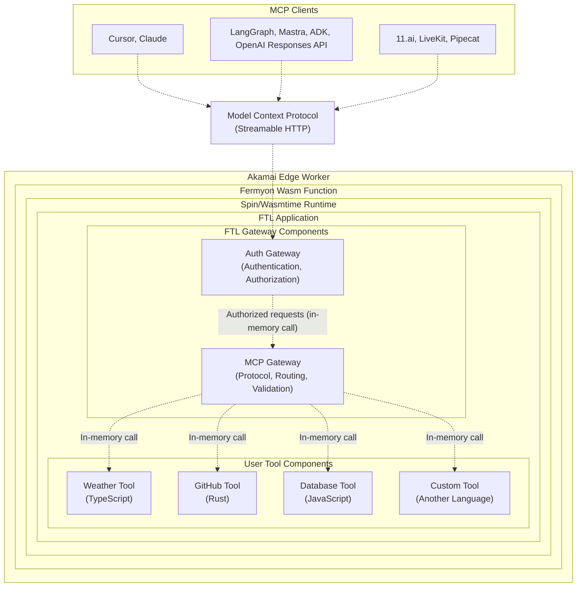

<div align="center">

# `ftl`

Fast tools for AI agents

[](https://github.com/fastertools/ftl-cli/actions/workflows/ci.yml)
[](LICENSE)
[](https://www.rust-lang.org)
[](https://webassembly.org/)

[Docs](./docs/introduction.md) | [Contributing](./CONTRIBUTING.md) | [Security](./SECURITY.md) | [Releases](https://github.com/fastertools/ftl-cli/releases)

⚡️ [Quick Start](#quick-start)

</div>

FTL is an open source framework and edge hosting platform for tools that extend the abilities of AI agents. It builds on the [WebAssembly Component Model](https://component-model.bytecodealliance.org/design/why-component-model.html) via [Spin](https://github.com/spinframework/spin) to provide a *just works* DX for the entire lifecycle of building and running secure, high performance [Model Context Protocol](https://modelcontextprotocol.io) tools authored in a variety of source languages, accessible over the network with low latency.

## Why?

MCP is minimal. Tools are straightforward. Writing and running them should be too. Performance and security should be a given.

<details>
<summary><strong>⤵ Sub-millisecond cold starts on global edge compute + Flexible deployment targets</strong></summary>

FTL tools run on any host compatible with Spin/[Wasmtime](https://github.com/bytecodealliance/wasmtime), including your development machine.

The FTL Platform aims to be the best way to host and manage remote tools that are fast and distributed enough be used by agents deployed anywhere, including real-time voice and multimodal systems. FTL runs on [Fermyon Wasm Functions](https://www.fermyon.com/wasm-functions) and [Akamai](https://www.akamai.com/why-akamai/global-infrastructure)'s globally distributed edge cloud. Latency and compute overhead for remote tool calls should not be something you have to design around.

- Workers automatically scale horizontally to meet demand, can cold start in < 1ms, and scale down to zero.
- The FTL [gateway components](#architecture) handle protocol complexity, auth, tool argument validation, and tool component routing.

The FTL Platform is optional. Opt in via the `ftl login` command, which enables `ftl deploy`.

See [ftl-mcp](https://github.com/fastertools/ftl-mcp) if you want to directly use, contribute to, or fork individual FTL components.
</details>

<details>
<summary><strong>⤵ Secure by default</strong></summary>

Tools run as individual WebAssembly components to provide sandboxed tool executions on a provably airtight [security model](https://webassembly.org/docs/security/). MCP endpoints are secured by [protocol-compliant authorization](https://modelcontextprotocol.io/specification/2025-06-18/basic/authorization). Plug in your own OIDC provider via simple configuration, or use FTL's by default.
</details>

<details>
<summary><strong>⤵ Use multiple source languages within one MCP server</strong></summary>

Write your MCP tools in Rust, TypeScript, Python, Go, C, and [more](https://component-model.bytecodealliance.org/language-support.html). If you can implement a basic HTTP route as a Wasm component, you can run it as an MCP tool with FTL.
</details>

<details>
<summary><strong>⤵ Distribute and compose tools like micro docker images</strong></summary>

Tools are compiled to self-contained Wasm binaries that are often < 1MB. They can be pushed and pulled directly from [OCI](https://opencontainers.org/)-compliant registries like Docker Hub, GitHub Container Registry, Amazon Elastic Container Registry, and more.
</details>

<details>
<summary><strong>⤵ Standards-based implementation</strong></summary>

Tools are built on and compatible with the [WebAssembly Component Model](https://component-model.bytecodealliance.org/design/why-component-model.html) via [Spin](https://github.com/spinframework/spin).
</details>

## Quick Start

Install `ftl`
```bash
cargo install ftl-cli
```

Set up templates
```bash
ftl setup templates
```

Create a new project
```bash
ftl init my-tools
cd my-tools
```

Develop new tools
```bash
ftl add
```

Serve your tools locally
```bash
ftl up --build
```

Try them out with your MCP client
```json
{
  "mcpServers": {
    "my-tools": {
      "url": "http://127.0.0.1:3000/mcp",
      "transport": "http"
    }
  }
}
```

Authenticate with FTL
```bash
ftl login
```

Deploy
```bash
ftl deploy
```

Plug it in
```json
{
  "mcpServers": {
    "my-tools": {
      "url": "https://d2c85b78-6487-4bee-a98c-5fa32f1598af.aka.fermyon.tech/mcp",
      "transport": "https"
    }
  }
}
```

## Developing tools

<details>
<summary><strong>🦀 Rust</strong></summary>

```rust
use ftl_sdk::{tool, ToolResponse};
use serde::Deserialize;
use schemars::JsonSchema;

#[derive(Deserialize, JsonSchema)]
struct MyToolInput {
    /// The message to process
    message: String,
}

/// A simple MCP tool
#[tool]
fn my_tool(input: MyToolInput) -> ToolResponse {
    ToolResponse::text(format!("Processed: {}", input.message))
}
```
</details>

<details>
<summary><strong>🟦 TypeScript</strong></summary>

```typescript
import { createTool, ToolResponse } from 'ftl-sdk'
import { z } from 'zod'

// Define the schema using Zod
const ToolSchema = z.object({
  message: z.string().describe('The message to process')
})

type ToolInput = z.infer<typeof ToolSchema>

const tool = createTool<ToolInput>({
  metadata: {
    name: 'my_tool',
    title: 'My Tool',
    description: 'A simple MCP tool',
    inputSchema: z.toJSONSchema(ToolSchema)
  },
  handler: async (input) => {
    return ToolResponse.text(`Processed: ${input.message}`)
  }
})

//@ts-ignore
addEventListener('fetch', (event: FetchEvent) => {
  event.respondWith(tool(event.request))
})
```
</details>

## Architecture



- Each tool runs as a separate WebAssembly component in its own sandbox.
- The FTL gateway components handle protocol complexity, auth, tool argument validation, and tool component routing.
- Individual components are composed onto a single worker that exposes a secure, protocol-compliant MCP server.
- Workers automatically scale horizontally to meet demand, can cold start in < 1ms, and scale down to zero.
- Cross-component calls happen in memory with no network latency, while maintaining security boundaries.

## Contributing

We welcome contributions and discussion. Please see our [Contributing Guide](CONTRIBUTING.md) for details.

## License

Apache-2.0 - see [LICENSE](LICENSE) for details.

## Acknowledgments

FTL is built on top of these excellent projects:
- [Spin](https://github.com/fermyon/spin)
- [Model Context Protocol](https://modelcontextprotocol.io)
- [WebAssembly](https://webassembly.org)
