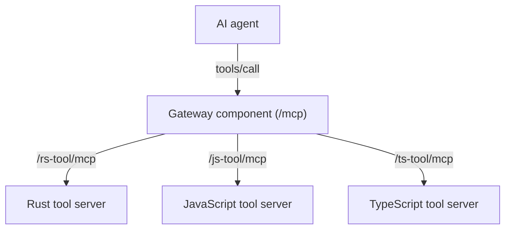

<div align="center">

# `ftl`

Fast tools for AI agents

[](https://github.com/fastertools/core/actions/workflows/ci.yml)
[](LICENSE)
[](https://www.rust-lang.org)
[](https://webassembly.org/)

[Docs](./docs/introduction.md) | [Contributing](./CONTRIBUTING.md) | [Security](./SECURITY.md) | [Releases](https://github.com/fastertools/ftl-cli/releases)

</div>

FTL is a platform for developing and deploying fast, edge-hosted [Model Context Protocol](https://modelcontextprotocol.io/introduction) tools for AI agents.

This repository contains the `ftl` command-line interface, which is the primary entry point.

## Getting Started

### Installation

```bash
cargo install ftl-cli
```

### Create a New Tool

<details>
<summary><b>🦀 Rust</b></summary>

```bash
ftl new my-tool --language rust
```

This creates a new directory with:
- `ftl.toml` - Tool manifest
- `spin.toml` - Spin application configuration
- `handler/` - Tool implementation directory
  - `Cargo.toml` - Rust dependencies
  - `src/lib.rs` - Tool implementation
  - `wit/mcp.wit` - WebAssembly interface definition

```rust
use serde_json::{json, Value};

wit_bindgen::generate!({
    world: "mcp-handler",
    path: "./wit",
    exports: {
        "component:mcp/handler": Component
    }
});

use exports::component::mcp::handler::{Guest, Tool, ToolResult, Error as McpError};

struct Component;

impl Guest for Component {
    fn list_tools() -> Vec<Tool> {
        vec![Tool {
            name: "my_tool".to_string(),
            description: "My tool description".to_string(),
            input_schema: json!({
                "type": "object",
                "properties": {
                    "input": { "type": "string" }
                },
                "required": ["input"]
            }).to_string(),
        }]
    }
    
    fn call_tool(name: String, arguments: String) -> ToolResult {
        let args: Value = serde_json::from_str(&arguments).unwrap();
        let input = args["input"].as_str().unwrap_or("No input");
        ToolResult::Text(format!("Processed: {}", input))
    }
    
    // ... other required methods
}
```
</details>

<details>
<summary><b>🔷 TypeScript</b></summary>

```bash
ftl new my-tool --language typescript
```

This creates a new directory with:
- `ftl.toml` - Tool manifest
- `spin.toml` - Spin application configuration
- `handler/` - Tool implementation directory
  - `package.json` - Node dependencies
  - `tsconfig.json` - TypeScript configuration
  - `src/index.ts` - Tool implementation
  - `wit/mcp.wit` - WebAssembly interface definition

```typescript
import { handler } from '../generated/mcp';

const { Tool, ToolResult } = handler;

export const Handler = {
    listTools(): handler.Tool[] {
        return [{
            name: 'my-tool',
            description: 'My tool description',
            inputSchema: JSON.stringify({
                type: 'object',
                properties: {
                    input: { type: 'string' }
                },
                required: ['input']
            })
        }];
    },

    callTool(name: string, argumentsStr: string): handler.ToolResult {
        const args = JSON.parse(argumentsStr);
        const input = args.input || 'No input';
        return {
            tag: 'text',
            val: `Processed: ${input}`
        };
    }
    
    // ... other required methods
};
```

</details>

</details>

<details>
<summary><b>🟨 JavaScript</b></summary>

```bash
ftl new my-tool --language javascript
```

This creates a new directory with:
- `ftl.toml` - Tool manifest
- `spin.toml` - Spin application configuration
- `handler/` - Tool implementation directory
  - `package.json` - Node dependencies
  - `src/index.js` - Tool implementation
  - `wit/mcp.wit` - WebAssembly interface definition

```javascript
import { handler } from '../generated/mcp.js';

const { Tool, ToolResult } = handler;

export const Handler = {
    listTools() {
        return [{
            name: 'my-tool',
            description: 'My tool description',
            inputSchema: JSON.stringify({
                type: 'object',
                properties: {
                    input: { type: 'string' }
                },
                required: ['input']
            })
        }];
    },

    callTool(name, argumentsStr) {
        const args = JSON.parse(argumentsStr);
        const input = args.input || 'No input';
        return {
            tag: 'text',
            val: `Processed: ${input}`
        };
    }
    
    // ... other required methods
};
```

</details>

### Serve Locally

```bash
ftl serve
```

This will start a local development server with hot reloading. You can test your tool by sending it a JSON-RPC request:

```bash
curl -X POST http://localhost:3000/mcp \
  -H "Content-Type: application/json" \
  -d '{"jsonrpc":"2.0","method":"tools/call","params":{"name":"my-tool","arguments":{"input":"test"}},"id":1}'
```

Each FTL tool is a complete MCP server that exposes a single tool. When you deploy an individual tool, you're deploying a standalone MCP server. Toolkits (described below) bundle multiple tools together with a gateway that acts as a unified MCP server over multiple tools.

### Deploy to FTL Edge

```bash
ftl deploy
```

This will deploy your tool to FTL Edge, where it can be called by your AI agents.

## Toolkits

FTL supports bundling multiple tools together as a toolkit, providing a powerful way to create comprehensive agent capabilities. Toolkits leverage the WebAssembly component model to enable secure, high-performance composition of tools.

### Architecture

Each FTL tool is a self-contained WebAssembly component that implements its own MCP server exposing a single tool. Toolkits take this further by:

- **Component Composition**: Multiple WebAssembly components (tools) are bundled together using the component model.
- **Automatic Gateway**: FTL generates a gateway component that acts as a logical MCP server over each tool in the toolkit. The hop between the gateway component and the tool component happens fast, in memory.
- **Language Agnostic**: Each tool can be written in a different language (Rust, JavaScript, etc.), allowing you to mix languages within a single toolkit / MCP server.
- **Fast Tool Chaining**: Tools within a toolkit can be chained directly via instant in-memory calls.
- **Local Development**: Toolkits work seamlessly both locally and when deployed to the edge.

### How It Works



The gateway component:
- Exposes a Streamable HTTP /mcp endpoint that exposes an MCP server over all individual tool components
- Routes `tools/call` requests to the appropriate tool component
- Maintains protocol compatibility across all tools
- The request is passed from the gateway component to the tool in memory without leaving the host process. This is fast.

### Create a Toolkit

```bash
# Build individual tools (can be different languages)
ftl new rust-analyzer    # Rust tool
ftl new js-formatter     # JavaScript tool  
ftl new ts-linter        # TypeScript tool
ftl new data-processor   # Another Rust tool

# Bundle them as a toolkit
ftl toolkit build --name dev-toolkit rust-analyzer js-formatter ts-linter data-processor
```

### Serve a Toolkit Locally

```bash
ftl toolkit serve dev-toolkit
```

This starts a local server with:
- `/mcp` - Unified endpoint that aggregates all tools
- `/rust-analyzer/mcp` - Direct access to individual tool
- `/js-formatter/mcp` - Direct access to individual tool
- `/ts-linter/mcp` - Direct access to individual tool
- `/data-processor/mcp` - Direct access to individual tool

### Deploy a Toolkit

```bash
ftl toolkit deploy dev-toolkit
```

### Benefits

- **Single Integration Point**: AI agents connect to one MCP endpoint to access all tools
- **Mixed Language Support**: Combine Rust tools for performance-critical operations with JavaScript/TypeScript tools for rapid development
- **Component Isolation**: Each tool runs in its own sandboxed WebAssembly module
- **Local-First Development**: Test complete toolkits locally before deployment
- **Dynamic Composition**: Add or remove tools without changing agent configurations

## Documentation

For more detailed documentation, please see the [docs](./docs/introduction.md) directory in this repository.

## Development

### Running CI Checks Locally

This project uses [just](https://github.com/casey/just) for task automation. Install it with:

```bash
cargo install-just
# or install all dev tools:
cargo install-dev-tools
```

Then you can run:

```bash
# Run all CI checks (same as CI)
just ci

# Individual checks
just fmt-check    # Check formatting
just lint         # Run clippy with CI settings  
just test-all     # Run all tests

# Development helpers
just fix          # Fix formatting and clippy warnings
just fix-fmt      # Auto-fix formatting only
just fix-clippy   # Auto-fix clippy warnings only

# Quick checks
just dev          # Format and lint (quick check)
just pre-push     # Fix and test before pushing

# Other tasks
just build-wasm   # Build the SDK for WASM target
just spin-install # Install FTL-managed Spin

# See all available commands
just --list
```

## Contributing

Contributions are welcome! Please see our [Contributing Guide](CONTRIBUTING.md) for more information.

## License

This project is licensed under the Apache-2.0 License.
