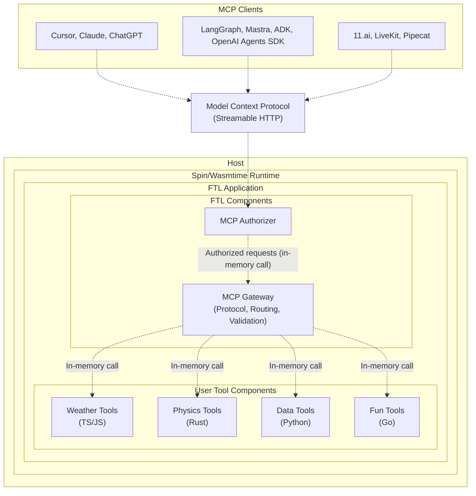

<div align="center">

# `ftl`

Faster tools for AI agents

[](LICENSE)
[](https://webassembly.org/)
[](https://www.rust-lang.org)
[](https://discord.gg/ByFw4eKEU7)

[Docs](./docs/README.md) | [Contributing](./CONTRIBUTING.md) | [Releases](https://github.com/fastertools/ftl-cli/releases)

⚡️ [Quick Start](#quick-start)

</div>

FTL is a framework for building and running polyglot [Model Context Protocol](https://modelcontextprotocol.io) servers on [WebAssembly components](https://component-model.bytecodealliance.org/design/why-component-model.html) via [Spin](https://github.com/spinframework/spin).

FTL MCP servers are remote-ready and can be called over the network by any MCP client, including Cursor and Claude Code.

Python, Rust, TypeScript, and Go tools can run co-isolated alongside each other within a single sandboxed MCP server process on any host compatible with Spin/[Wasmtime](https://github.com/bytecodealliance/wasmtime).

FTL Engine is a new agent tool platform powered by [Fermyon Wasm Functions](https://www.fermyon.com/wasm-functions) and [Akamai](https://www.akamai.com/why-akamai/global-infrastructure)'s globally distributed edge compute network. It aims to be a complete surface for running lag-free MCP servers over Streamable HTTP, with sub-millisecond cold starts and consistently low latency across geographic regions. Talk to us on [Discord](https://discord.gg/ByFw4eKEU7) to request early access.

<div align="center">
<em>Example: A Python text processing tool called from 5 continents</em>


</div>

## Why?

### Simple MCP Server DX across languages

<details>
<summary><strong>Write tools in TypeScript, Rust, Python, and Go.</strong></summary>

Combine co-isolated tools from different [source languages](./sdk/README.md) onto a single server process over the `/mcp` [Streamable HTTP](https://modelcontextprotocol.io/specification/2025-03-26/basic/transports#streamable-http) endpoint. See [Architecture](#architecture) for details.

Tool components can be individually distributed on OCI registries like Docker Hub and GitHub Container Registry.

Tool binary size and performance are influenced by choice of source language. High performance features like [SIMD](https://github.com/WebAssembly/spec/blob/main/proposals/simd/SIMD.md) are available in Rust.
</details>

### Secure by design

<details>
<summary><strong>Internal isolation and MCP-compliant authorization.</strong></summary>

Each WebAssembly module executes within a [sandboxed](https://webassembly.org/docs/security/) environment separated from the host runtime using fault isolation techniques.

A [component](https://component-model.bytecodealliance.org/design/why-component-model.html#components) is a WebAssembly binary (which may or may not contain modules) that is restricted to interact only through the modules' imported and exported functions.

Allowed outbound hosts and accessible variables can be configured per individual tool component within a server.

Out-of-the-box support for configurable [MCP-compliant authorization](https://modelcontextprotocol.io/specification/2025-06-18/basic/authorization), including
- OAuth 2.0 Dynamic Client Registration Protocol (RFC7591).
- OAuth 2.0 Protected Resource Metadata (RFC9728).
- OAuth 2.0 Authorization Server Metadata (RFC8414).

Plug in your own JWT issuer with simple configuration.
</details>

### Edge deployments on FTL Engine
<details>
<summary><strong>FTL Engine is an end-to-end platform for running remote tools called by AI agents.</strong></summary>

Tools cold start in under half a millisecond, instantly scale up to meet demand, and scale down to zero.

Engines run on [Fermyon Wasm Functions](https://www.fermyon.com/wasm-functions) and [Akamai](https://www.akamai.com/why-akamai/global-infrastructure), the most globally distributed edge compute network.

Cost scales predictably with usage. There are no idle costs and no price variables like execution duration, region, memory, provisioned concurrency, reserved concurrency, [etc](https://aws.amazon.com/lambda/pricing/). Cold starts and init phases are architected out. Engine specs are fixed and scaling is completely horizontal and automatic.

Tools are automatically deployed across the global network edge. Tool calls are routed to an Engine running on the most optimal Akamai edge PoP, enabling consistently low latency across geographic regions.

The FTL [components](#architecture) handle MCP implementation, auth, tool call routing, and tool call argument validation.

Bring your own JWT issuer or OIDC provider via simple configuration. Or use FTL's by default.

Join [Discord](https://discord.gg/ByFw4eKEU7) to request access.
</details>

## Prerequisites

To build tools in different languages, you'll need the corresponding toolchains:

- **Rust**: `cargo` (via [rustup](https://rustup.rs/))
- **TypeScript/JavaScript**: `node` and `npm` (via [Node.js](https://nodejs.org/))
- **Python**: `python3` and `componentize-py` (install with `pip install componentize-py`)
- **Go**: `go` and `tinygo` (via [Go](https://golang.org/) and [TinyGo](https://tinygo.org/))

## Quick Start

Install `ftl`
```bash
curl -fsSL https://$(gh auth token)@raw.githubusercontent.com/fastertools/ftl-cli/main/install.sh | bash
```

Create a new project
```bash
ftl init faster-tools && cd faster-tools
```

Scaffold tools
```bash
ftl add
```

Develop and serve locally
```bash
ftl up --watch
```

Try it out with your MCP client
```json
{
  "mcpServers": {
    "fastTools": {
      "url": "http://127.0.0.1:3000/mcp",
      "transport": "http"
    }
  }
}
```
```bash
claude mcp add -t http faster-tools http://127.0.0.1:3000/mcp
```

### Ready to deploy?

Join [Discord](https://discord.gg/ByFw4eKEU7) to request access.

Log in to FTL Engine
```bash
ftl eng login
```

Deploy
```bash
ftl eng deploy
```

Plug it in
```json
{
  "mcpServers": {
    "fasterTools": {
      "url": "https://ce8860d9-518b-4122-97ab-2e664f6875d9.fwf.app/mcp",
      "transport": "http"
    }
  }
}
```
```bash
claude mcp add -t http faster-tools https://ce8860d9-518b-4122-97ab-2e664f6875d9.fwf.app/mcp
```

## Architecture



- Tool components are composed together with the FTL MCP authorizer and gateway components, runing as a single MCP server process on the host.
- The FTL gateway components handle protocol complexity, auth, tool argument validation, and tool component routing.
- Cross-component calls happen in memory with no network latency, while maintaining secure boundaries.

## Contributing

We welcome contributions and discussion. Please see the [Contributing Guide](CONTRIBUTING.md) for details.

## License

Apache-2.0 - see [LICENSE](LICENSE) for details.

## Acknowledgments

FTL is built on top of these excellent projects:
- [Spin](https://github.com/fermyon/spin)
- [Model Context Protocol](https://modelcontextprotocol.io)
- [WebAssembly](https://webassembly.org)
