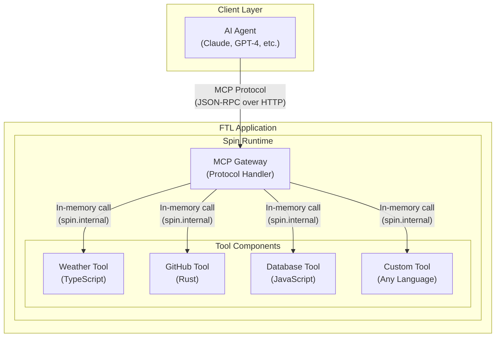

<div align="center">

# `ftl`

Fast tools for AI agents

[](https://github.com/fastertools/ftl-cli/actions/workflows/ci.yml)
[](LICENSE)
[](https://www.rust-lang.org)
[](https://webassembly.org/)

[Docs](./docs/introduction.md) | [Contributing](./CONTRIBUTING.md) | [Security](./SECURITY.md) | [Releases](https://github.com/fastertools/ftl-cli/releases)

</div>

FTL is an open source framework and [edge-powered](https://www.fermyon.com/wasm-functions) hosting platform for tools accessed by AI agents. It builds on the [WebAssembly Component Model](https://component-model.bytecodealliance.org/design/why-component-model.html) via [Spin](https://github.com/spinframework/spin) to provide a *just works* DX for the entire development and hosting lifecycle of secure, high performance [MCP](https://modelcontextprotocol.io) tools authored in a variety of source languages.

⚡️ [Quick Start](#quick-start)

## Why?

Remote MCP servers allow AI agents deployed anywhere to access tools that extend their capabilities. But when tools are called over the network, every execution comes with latency. For agents deployed in voice, video, and other real-time and performance sensitive applications, that latency adds up to impact the behavior of the whole system.

FTL is a great option for agents deployed anywhere that want remotely accessible tools with:

<details>
<summary><strong>⤵ Sub-millisecond cold starts on global edge compute</strong></summary>

The FTL platform runs on [Fermyon Wasm Functions](https://www.fermyon.com/wasm-functions) and [Akamai](https://www.akamai.com/why-akamai/global-infrastructure)'s globally distributed edge cloud. Agents deployed anywhere can instanly access their networked tools with almost no latency.
</details>

<details>
<summary><strong>⤵ Security by default</strong></summary>

Tools run as individual WebAssembly components to provide sandboxed tool executions on a provably airtight [security model](https://webassembly.org/docs/security/). MCP endpoints are secured by [protocol-compliant authorization](https://modelcontextprotocol.io/specification/2025-06-18/basic/authorization). Plug in your own OIDC provider via simple configuration, or use FTL's by default.
</details>

<details>
<summary><strong>⤵ Multiple source languages within one MCP server</strong></summary>

Write your MCP tools in Rust, TypeScript, Python, Go, C, and [more](https://component-model.bytecodealliance.org/language-support.html). If you can implement a basic HTTP route as a Wasm component, you can run it as an MCP tool with FTL.
</details>

<details>
<summary><strong>⤵ Run anywhere</strong></summary>

Run your FTL-based tools on your own machine, Kubernetes, Wasmtime, Fermyon, and other [WASI](https://wasi.dev/)-compatible runtimes. The FTL platform aims to be the best way to manage agent tools, but you are not locked in.
</details>

<details>
<summary><strong>⤵ Distribute and compose tools like tiny docker images</strong></summary>

Tools are compiled to self-contained Wasm binaries that are often < 1MB. They can be pushed and pulled directly from [OCI](https://opencontainers.org/)-compliant registries like Docker Hub, GitHub Container Registry, Amazon Elastic Container Registry, and more.
</details>

<details>
<summary><strong>⤵ Standards-based implementation</strong></summary>

Tools are built on and compatible with the [WebAssembly Component Model](https://component-model.bytecodealliance.org/design/why-component-model.html) via [Spin](https://github.com/spinframework/spin).
</details>

---

You want one direct, end-to-end answer to the question of "How do I give my agent new computational capabilities?" that goes beyond being a connector hub for third party apps. And you don't want to have to figure out performance, scalability, security, and distribution from scratch. You want to think about tools and the agents that use them.

## Quick Start

```bash
# Install FTL
cargo install ftl-cli

# Set up templates
ftl setup templates

# Create a new project
ftl init my-tools
cd my-tools

# Add new tools
ftl add

# Serve your tools and test locally with your MCP client
ftl up --build

# Authenticate with FTL
ftl login

# Deploy
ftl deploy
```

## Creating tools

<details>
<summary><strong>🦀 Rust example</strong></summary>

Add a Rust tool to a project
```bash
cd my-project
ftl add my-tool --language rust
```

```rust
// my-tool/src/lib.rs

use ftl_sdk::{tool, ToolResponse};
use serde::Deserialize;
use schemars::JsonSchema;

#[derive(Deserialize, JsonSchema)]
struct MyToolInput {
    /// The message to process
    message: String,
}

/// A simple MCP tool
#[tool]
fn my_tool(input: MyToolInput) -> ToolResponse {
    ToolResponse::text(format!("Processed: {}", input.message))
}
```
</details>

<details>
<summary><strong>🟦 TypeScript example</strong></summary>

Add a TypeScript tool to a project
```bash
ftl add my-tool --language typescript
```

```typescript
// my-tool/src/index.ts

import { createTool, ToolResponse } from 'ftl-sdk'
import { z } from 'zod'

// Define the schema using Zod
const ToolSchema = z.object({
  message: z.string().describe('The message to process')
})

type ToolInput = z.infer<typeof ToolSchema>

const tool = createTool<ToolInput>({
  metadata: {
    name: 'my_tool',
    title: 'My Tool',
    description: 'A simple MCP tool',
    inputSchema: z.toJSONSchema(ToolSchema)
  },
  handler: async (input) => {
    return ToolResponse.text(`Processed: ${input.message}`)
  }
})

//@ts-ignore
addEventListener('fetch', (event: FetchEvent) => {
  event.respondWith(tool(event.request))
})
```
</details>

### Workflow

### 1. Develop
```bash
# From project root (with spin.toml)
ftl build           # Build all tools
ftl test            # Run tests
ftl watch           # Auto-rebuild on changes
ftl up              # Run the MCP server
```

### 2. Plug in to your local MCP Client Configuration
```json
{
  "mcpServers": {
    "my-assistant": {
      "url": "http://127.0.0.1:3000/mcp",
      "transport": "http"
    }
  }
}
```

### 3. Deploy
```bash
ftl deploy
```

## Architecture

The ftl-cli uses the [ftl-mcp](https://github.com/fastertools/ftl-mcp) framework and Spin platform to create a highly optimized MCP server runtime:

## Architecture Overview



- Each tool is a separate WebAssembly component with its own sandbox
- The MCP Gateway handles all protocol complexity, routing, and auth
- The gateway routes to tools via Spin's local service chaining (no network latency)
- Deploys are automatically distributed across the global network edge via Akamai for minimal latency

## Contributing

We welcome contributions and discussion. Please see our [Contributing Guide](CONTRIBUTING.md) for details.

## License

Apache-2.0 - see [LICENSE](LICENSE) for details.

## Acknowledgments

FTL is built on top of these excellent projects:
- [Spin](https://github.com/fermyon/spin)
- [Model Context Protocol](https://modelcontextprotocol.io)
- [WebAssembly](https://webassembly.org)
