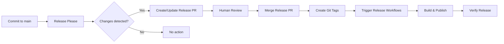

# FTL Release Process

## Overview

FTL uses [Google's release-please](https://github.com/googleapis/release-please) for automated release management across our polyglot monorepo. This system provides:

- **Automated version management** based on conventional commits
- **Automated changelog generation** from commit messages
- **Multi-component releases** with independent versioning
- **Cross-platform binary distribution** for the CLI
- **Multi-registry package publishing** for SDKs
- **WASM component releases** with container registry distribution

## Table of Contents

- [For Contributors](#for-contributors)
- [For Maintainers](#for-maintainers)
- [Release Components](#release-components)
- [Version Management](#version-management)
- [Release Workflow](#release-workflow)
- [Troubleshooting](#troubleshooting)
- [Migration Guide](#migration-guide)

## For Contributors

### Conventional Commits

All commits to the repository must follow the [Conventional Commits](https://www.conventionalcommits.org) specification. This enables automated version bumping and changelog generation.

#### Commit Format

```
<type>(<scope>): <subject>

[optional body]

[optional footer(s)]
```

#### Types

- **feat**: A new feature (triggers minor version bump)
- **fix**: A bug fix (triggers patch version bump)
- **perf**: A performance improvement (triggers patch version bump)
- **refactor**: Code change that neither fixes a bug nor adds a feature
- **docs**: Documentation only changes
- **test**: Adding missing tests or correcting existing tests
- **build**: Changes that affect the build system or external dependencies
- **ci**: Changes to CI configuration files and scripts
- **chore**: Other changes that don't modify src or test files
- **style**: Changes that do not affect the meaning of the code
- **revert**: Reverts a previous commit

#### Scopes

- **cli**: Changes to the FTL CLI
- **sdk**: General SDK changes
- **sdk/go**: Go SDK specific changes
- **sdk/rust**: Rust SDK specific changes
- **sdk/python**: Python SDK specific changes
- **sdk/typescript**: TypeScript SDK specific changes
- **wasm**: WASM component changes
- **components**: Component-related changes
- **core**: Core functionality changes
- **deps**: Dependency updates
- **release**: Release-related changes
- **docs**: Documentation changes
- **ci**: CI/CD changes

#### Examples

```bash
# Feature with scope
feat(cli): add support for dry-run deployments

# Bug fix with scope
fix(sdk/rust): resolve WASM runtime panic when handling large payloads

# Breaking change (triggers major version bump)
feat(api)!: change authentication token format

BREAKING CHANGE: Authentication tokens now use JWT format instead of API keys.
Users must regenerate their tokens.

# Multiple-line commit with details
fix(sdk/python): correct type hints for async methods

- Fixed incorrect return type annotations
- Added missing async context manager types
- Updated documentation examples

Fixes #123
```

### Pull Request Guidelines

1. **PR Title**: Must follow conventional commit format
   - The PR title becomes the commit message when squash-merged
   - Example: `feat(cli): add deployment rollback command`

2. **PR Description**: Should include:
   - Clear description of changes
   - Testing performed
   - Breaking changes (if any) with migration guide
   - Related issues

3. **Automated Validation**: PRs are automatically checked for:
   - Conventional commit format in title
   - Version consistency
   - WASM compatibility constraints
   - Build and test success

## For Maintainers

### Release Flow

1. **Automatic PR Creation**: Release-please automatically creates/updates release PRs when commits land on `main`
2. **Review Release PR**: Contains version bumps, changelog updates, and file modifications
3. **Merge Release PR**: Triggers automated release workflows
4. **Monitor Releases**: Verify all components released successfully

### Manual Interventions

#### Triggering a Specific Release

To force a release of a specific component:

```bash
# Force a minor version bump for CLI
git commit --allow-empty -m "feat(cli): trigger release"

# Force a patch version bump for Rust SDK
git commit --allow-empty -m "fix(sdk/rust): trigger patch release"
```

#### Synchronizing SDK Versions

SDKs are configured to maintain version parity through the `linked-versions` plugin. To manually synchronize:

1. Update `.release-please-manifest.json` with desired versions
2. Run validation workflow: `gh workflow run release-validation.yml`
3. Commit changes with: `chore(release): synchronize SDK versions`

### Emergency Procedures

#### Rolling Back a Release

1. **Revert the release commit**:
   ```bash
   git revert <release-commit-sha>
   git push origin main
   ```

2. **Manually unpublish if needed**:
   - NPM: `npm unpublish @ftl/sdk@<version>` (within 72 hours)
   - PyPI: Cannot unpublish, release new patch version
   - Crates.io: `cargo yank --vers <version>`
   - Container registry: Delete specific tags via GitHub UI

3. **Create fix and release patch version**

## Release Components

### Component Types

| Component | Type | Registry | Versioning Strategy |
|-----------|------|----------|-------------------|
| FTL CLI | Binary | GitHub Releases | Independent |
| Go SDK | Module | GitHub (Git tags) | Linked with other SDKs |
| Rust SDK | Crate | crates.io | Linked with other SDKs |
| Python SDK | Package | PyPI | Linked with other SDKs |
| TypeScript SDK | Package | NPM | Linked with other SDKs |
| MCP Gateway | WASM | ghcr.io | Independent (beta) |
| MCP Authorizer | WASM | ghcr.io | Independent (beta) |

### Version Synchronization

- **SDKs**: Maintain version parity through `linked-versions` plugin
- **CLI**: Independent versioning
- **Components**: Independent versioning with beta/prerelease support
- **Templates**: Automatically updated to use latest versions

## Version Management

### Version Files

The following files track versions and are automatically updated:

1. **`.release-please-manifest.json`**: Source of truth for all component versions
2. **`internal/scaffold/versions.json`**: Template versions for `ftl init`
3. **Language-specific files**:
   - `Cargo.toml` for Rust
   - `package.json` for TypeScript
   - `pyproject.toml` for Python
   - `go.mod` for Go (via tags)

### Version Bump Rules

Based on conventional commits since last release:

- **Major (x.0.0)**: Breaking changes (`feat!:` or `BREAKING CHANGE:`)
- **Minor (0.x.0)**: New features (`feat:`)
- **Patch (0.0.x)**: Bug fixes (`fix:`) and performance improvements (`perf:`)

### Pre-release Versions

WASM components use pre-release versions:

```json
{
  "versioning": "prerelease",
  "prerelease-type": "beta"
}
```

Results in versions like: `0.1.0-beta.1`, `0.1.0-beta.2`, etc.

## Release Workflow

### Automated Release Pipeline



### Component-Specific Workflows

#### CLI Release (`release-cli-binaries.yml`)
1. Build multi-platform binaries (Linux/macOS, AMD64/ARM64)
2. Create archives with checksums
3. Generate install script
4. Create GitHub release
5. Build and push Docker images
6. Update Homebrew formula

#### SDK Releases
- **Go**: Create module tag, notify Go proxy
- **Rust**: Publish macros then main crate to crates.io
- **Python**: Build wheel/sdist, publish to PyPI
- **TypeScript**: Build package, publish to NPM

#### WASM Component Release (`release-wasm-component.yml`)
1. Build WASM component
2. Validate size constraints (<10MB)
3. Optimize with wasm-tools
4. Publish to container registry
5. Sign with cosign
6. Create GitHub release

### Post-Release Actions

1. **Verification**: Automated checks confirm packages are available
2. **Documentation**: API docs generated and deployed
3. **Notifications**: Issues created to notify downstream projects
4. **Template Updates**: Scaffold versions automatically updated

## Troubleshooting

### Common Issues

#### Release PR Not Created

**Symptoms**: No release PR appears after merging commits

**Solutions**:
1. Verify commits follow conventional format
2. Check release-please workflow logs
3. Ensure `release-please-config.json` is valid
4. Manual trigger: `gh workflow run release-please.yml`

#### Version Mismatch Errors

**Symptoms**: Release validation fails with version mismatches

**Solutions**:
1. Run validation locally:
   ```bash
   gh workflow run release-validation.yml
   ```
2. Synchronize versions:
   ```bash
   # Update all version files
   make sync-versions
   ```
3. Commit fixes:
   ```bash
   git commit -m "chore(release): fix version synchronization"
   ```

#### Package Publishing Failures

**Symptoms**: Package fails to publish to registry

**Solutions**:
1. **NPM**: Check authentication token in secrets
2. **PyPI**: Verify trusted publishing configuration
3. **Crates.io**: Ensure token has publish permissions
4. **Retry**: Most workflows can be re-run from GitHub UI

#### WASM Size Violations

**Symptoms**: WASM component exceeds 10MB limit

**Solutions**:
1. Enable optimizations in `Cargo.toml`:
   ```toml
   [profile.release]
   opt-level = "z"
   lto = true
   strip = true
   ```
2. Remove unnecessary dependencies
3. Use `wasm-opt` for additional optimization

### Manual Release Process

If automation fails, follow these steps:

1. **Update versions manually**:
   ```bash
   # Edit .release-please-manifest.json
   # Edit internal/scaffold/versions.json
   # Update language-specific files
   ```

2. **Create release tag**:
   ```bash
   git tag -a "cli-v1.0.0" -m "Release CLI v1.0.0"
   git push origin "cli-v1.0.0"
   ```

3. **Trigger workflow manually**:
   ```bash
   gh workflow run release-cli-binaries.yml \
     -f version=1.0.0 \
     -f tag=cli-v1.0.0
   ```

## Migration Guide

### From Old Release System

#### Phase 1: Preparation (Week 1)
1. Ensure all pending releases are completed
2. Archive old release workflows (don't delete yet)
3. Train team on conventional commits
4. Set up required secrets:
   - `CARGO_REGISTRY_TOKEN`
   - `NPM_TOKEN` (optional, can use OIDC)
   - `PYPI_API_TOKEN` (optional, can use trusted publishing)

#### Phase 2: Configuration (Week 2)
1. Merge release-please configuration files
2. Validate with `release-validation.yml`
3. Test with dry-run on feature branch
4. Document team-specific procedures

#### Phase 3: Cutover (Week 3)
1. Merge release-please to main
2. Monitor first automated release PR
3. Perform test release of one component
4. Address any issues

#### Phase 4: Cleanup (Week 4)
1. Remove old release workflows
2. Update documentation
3. Close migration tracking issue

### Rollback Plan

If migration needs to be reverted:

1. Disable release-please workflow
2. Re-enable old workflows from archive
3. Remove release-please configuration files
4. Document lessons learned

## Best Practices

### Do's
- ✅ Write clear, descriptive commit messages
- ✅ Use appropriate commit types and scopes
- ✅ Include breaking change information when needed
- ✅ Review release PRs carefully before merging
- ✅ Monitor release workflows for failures
- ✅ Keep versions synchronized within linked groups

### Don'ts
- ❌ Don't manually edit release PRs (changes will be overwritten)
- ❌ Don't bypass conventional commit validation
- ❌ Don't force-push to main branch
- ❌ Don't manually create release tags (except for recovery)
- ❌ Don't ignore failing validation workflows

## Support

### Getting Help
- Check workflow logs in GitHub Actions
- Review [release-please documentation](https://github.com/googleapis/release-please)
- Open issue with label `release-process`
- Contact release team in #releases Slack channel

### Monitoring
- [GitHub Actions Dashboard](https://github.com/fastertools/ftl-cli/actions)
- [Release History](https://github.com/fastertools/ftl-cli/releases)
- Package Registries:
  - [NPM](https://www.npmjs.com/package/@ftl/sdk)
  - [PyPI](https://pypi.org/project/ftl-sdk/)
  - [Crates.io](https://crates.io/crates/ftl-sdk)
  - [Container Registry](https://github.com/orgs/fastertools/packages)

## Appendix

### Environment Variables

| Variable | Description | Required |
|----------|-------------|----------|
| `CARGO_REGISTRY_TOKEN` | Crates.io publishing token | For Rust SDK |
| `NPM_TOKEN` | NPM publishing token | Optional (OIDC available) |
| `PYPI_API_TOKEN` | PyPI publishing token | Optional (trusted publishing) |
| `SPIN_AUTH_TOKEN` | Spin registry token | Optional |
| `HOMEBREW_TAP_TOKEN` | Homebrew tap update token | Optional |

### Configuration Files

- `release-please-config.json`: Main configuration
- `.release-please-manifest.json`: Version tracking
- `.github/workflows/release-please.yml`: Main workflow
- `.github/workflows/release-*.yml`: Component workflows
- `.gitmessage`: Commit message template

### Related Documentation

- [Conventional Commits Specification](https://www.conventionalcommits.org)
- [Release Please Documentation](https://github.com/googleapis/release-please)
- [Semantic Versioning](https://semver.org)
- [FTL Contributing Guide](CONTRIBUTING.md)