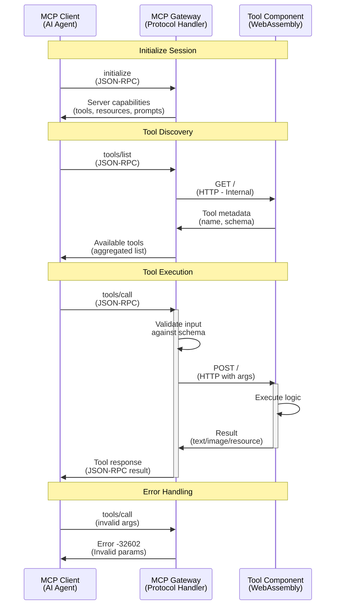

# MCP API Reference

This document describes the Model Context Protocol (MCP) API implementation in FTL. For the full MCP specification, see [modelcontextprotocol.io](https://modelcontextprotocol.io).

## Overview

FTL implements the MCP protocol through a gateway component that routes JSON-RPC requests to individual tool components. Each tool is a WebAssembly module that responds to HTTP requests.

## Protocol Flow



### Protocol Layers

1. **Transport Layer**: HTTP/HTTPS for client-gateway communication
2. **Protocol Layer**: JSON-RPC 2.0 for MCP protocol
3. **Routing Layer**: Internal HTTP for gateway-tool communication
4. **Execution Layer**: WebAssembly sandbox for tool execution

## JSON-RPC Methods

### Core Methods

#### `initialize`
Establishes protocol version and capabilities.

**Request**:
```json
{
  "jsonrpc": "2.0",
  "method": "initialize",
  "params": {
    "protocolVersion": "0.1.0",
    "capabilities": {
      "tools": {}
    },
    "clientInfo": {
      "name": "example-client",
      "version": "1.0.0"
    }
  },
  "id": 1
}
```

**Response**:
```json
{
  "jsonrpc": "2.0",
  "result": {
    "protocolVersion": "0.1.0",
    "capabilities": {
      "tools": {}
    },
    "serverInfo": {
      "name": "ftl-mcp-gateway",
      "version": "0.1.0"
    }
  },
  "id": 1
}
```

### Tool Methods

#### `tools/list`
Lists all available tools registered with the gateway.

**Request**:
```json
{
  "jsonrpc": "2.0",
  "method": "tools/list",
  "id": 2
}
```

**Response**:
```json
{
  "jsonrpc": "2.0",
  "result": {
    "tools": [
      {
        "name": "weather",
        "description": "Get weather information for a location",
        "inputSchema": {
          "type": "object",
          "properties": {
            "location": {
              "type": "string",
              "description": "City name or coordinates"
            }
          },
          "required": ["location"]
        }
      }
    ]
  },
  "id": 2
}
```

#### `tools/call`
Executes a specific tool with provided arguments.

**Request**:
```json
{
  "jsonrpc": "2.0",
  "method": "tools/call",
  "params": {
    "name": "weather",
    "arguments": {
      "location": "San Francisco"
    }
  },
  "id": 3
}
```

**Response**:
```json
{
  "jsonrpc": "2.0",
  "result": {
    "content": [
      {
        "type": "text",
        "text": "Current weather in San Francisco: 68°F, partly cloudy"
      }
    ]
  },
  "id": 3
}
```

## Tool Component API

Each tool component must implement the following HTTP endpoints:

### GET /
Returns tool metadata including name, description, and input schema.

**Response Format**:
```json
{
  "name": "tool-name",
  "title": "Human Readable Name",
  "description": "What this tool does",
  "version": "1.0.0",
  "inputSchema": {
    "type": "object",
    "properties": {
      "param1": {
        "type": "string",
        "description": "Parameter description"
      }
    },
    "required": ["param1"]
  }
}
```

### POST /
Executes the tool with provided arguments.

**Request Body**:
```json
{
  "param1": "value1",
  "param2": "value2"
}
```

**Response Format**:
```json
{
  "content": [
    {
      "type": "text",
      "text": "Tool execution result"
    }
  ]
}
```

## Content Types

Tools can return different content types:

### Text Content
```json
{
  "type": "text",
  "text": "Plain text response"
}
```

### Image Content
```json
{
  "type": "image",
  "data": "base64-encoded-image-data",
  "mimeType": "image/png"
}
```

### Resource Content
```json
{
  "type": "resource",
  "resource": {
    "uri": "file:///path/to/resource",
    "text": "Resource content",
    "mimeType": "text/plain"
  }
}
```

## Error Handling

### Standard JSON-RPC Errors

| Code | Message | Description |
|------|---------|-------------|
| -32700 | Parse error | Invalid JSON |
| -32600 | Invalid request | Invalid JSON-RPC |
| -32601 | Method not found | Unknown method |
| -32602 | Invalid params | Invalid parameters |
| -32603 | Internal error | Server error |

### MCP-Specific Errors

| Code | Message | Description |
|------|---------|-------------|
| -32001 | Tool not found | Requested tool doesn't exist |
| -32002 | Tool error | Tool execution failed |
| -32003 | Invalid schema | Tool input doesn't match schema |
| -32004 | Gateway error | Gateway routing failed |

**Error Response Format**:
```json
{
  "jsonrpc": "2.0",
  "error": {
    "code": -32001,
    "message": "Tool not found",
    "data": {
      "tool": "unknown-tool"
    }
  },
  "id": 4
}
```

## Gateway Implementation

The MCP gateway handles:

1. **Protocol Translation**: JSON-RPC ↔ HTTP
2. **Tool Discovery**: Queries registered components
3. **Schema Validation**: Validates inputs against tool schemas
4. **Error Handling**: Converts component errors to JSON-RPC errors
5. **Routing**: Routes requests to appropriate components

### Tool Registration

Tools are registered in `spin.toml`:

```toml
[component.mcp-gateway.variables]
tool_components = ["weather-tool", "calculator-tool"]
```

### Internal Communication

Tools communicate via Spin's internal network:
- Pattern: `http://{component-name}.spin.internal/`
- No external network traffic
- Automatic service discovery

## SDK Integration

### TypeScript SDK

```typescript
import { createTool, ToolResponse } from 'ftl-sdk';
import { z } from 'zod';

const InputSchema = z.object({
  message: z.string()
});

export const tool = createTool({
  metadata: {
    name: 'example',
    description: 'An example tool',
    inputSchema: InputSchema
  },
  handler: async (input) => {
    return ToolResponse.text(`You said: ${input.message}`);
  }
});
```

### Rust SDK

```rust
use ftl_sdk::{tool, ToolResponse};
use serde::Deserialize;
use schemars::JsonSchema;

#[derive(Deserialize, JsonSchema)]
struct Input {
    message: String,
}

#[tool]
fn example(input: Input) -> ToolResponse {
    ToolResponse::text(format!("You said: {}", input.message))
}
```

## Best Practices

### Schema Design
- Use descriptive field names
- Provide clear descriptions for all parameters
- Mark required fields appropriately
- Use appropriate types (string, number, boolean, array, object)

### Error Messages
- Return user-friendly error messages
- Include context about what went wrong
- Suggest corrective actions when possible

### Performance
- Keep tool execution time under 30 seconds
- Stream large responses when possible
- Cache expensive computations

### Security
- Validate all inputs
- Sanitize outputs
- Don't expose internal errors to clients
- Use appropriate timeouts

## Testing Your Implementation

### Using curl

```bash
# List tools
curl -X POST http://localhost:3000/mcp \
  -H "Content-Type: application/json" \
  -d '{"jsonrpc":"2.0","method":"tools/list","id":1}'

# Call a tool
curl -X POST http://localhost:3000/mcp \
  -H "Content-Type: application/json" \
  -d '{
    "jsonrpc":"2.0",
    "method":"tools/call",
    "params": {
      "name": "example",
      "arguments": {"message": "Hello"}
    },
    "id": 2
  }'
```

### Using MCP Inspector

The MCP Inspector tool provides a GUI for testing MCP servers:

```bash
npx @modelcontextprotocol/inspector http://localhost:3000/mcp
```

## Compliance

FTL's MCP implementation follows the [Model Context Protocol Specification](https://spec.modelcontextprotocol.io) version 0.1.0.

Key compliance points:
- ✅ JSON-RPC 2.0 transport
- ✅ Tool discovery and execution
- ✅ Schema validation
- ✅ Standard error codes
- ✅ Content type support

## Advanced Topics

### Custom Content Types

Extend the protocol with custom content types:

```typescript
return {
  content: [{
    type: "custom/chart",
    data: chartData,
    metadata: { chartType: "bar" }
  }]
};
```

### Streaming Responses

For long-running operations, consider streaming:

```typescript
// Future SDK support
return ToolResponse.stream(async function* () {
  yield ToolResponse.text("Processing...");
  yield ToolResponse.text("Still working...");
  yield ToolResponse.text("Complete!");
});
```

### Tool Composition

Tools can call other tools internally:

```typescript
const weatherData = await fetch('http://weather-tool.spin.internal/', {
  method: 'POST',
  body: JSON.stringify({ location })
});
```