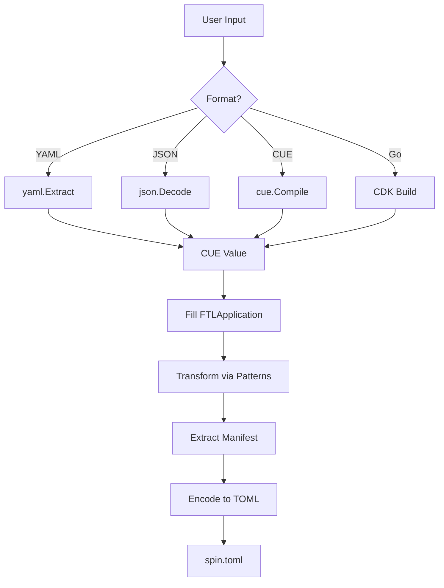

# FTL Architecture

## Overview

FTL uses a pure CUE-based architecture for transforming user configurations into Spin manifests. This design provides type safety, validation, and a clean separation between configuration formats and business logic.

## Core Components

### 1. Input Layer

FTL accepts multiple input formats, all of which are converted to CUE values:

- **YAML**: Parsed using CUE's yaml.Extract
- **JSON**: Parsed using CUE's json decoder
- **CUE**: Compiled directly
- **Go**: CDK generates CUE internally

```
YAML ─┐
JSON ─┼─→ CUE Value
CUE  ─┤
Go   ─┘
```

### 2. CUE Patterns (`patterns.cue`)

The heart of FTL's transformation logic. Defines:

- **Data Models**: `#FTLApplication`, `#Component`, `#AuthConfig`
- **Transformation Rules**: `#TransformToSpin`
- **Business Logic**: Component injection, auth configuration

```cue
#TransformToSpin: {
    input: #FTLApplication
    output: {
        spin_manifest_version: 2
        application: {...}
        component: {...}
        trigger: {...}
    }
}
```

### 3. Synthesizer

Orchestrates the transformation pipeline:

1. Parse input to CUE value
2. Fill application model
3. Apply transformation patterns
4. Encode to TOML

```go
func (s *Synthesizer) synthesizeFromValue(input cue.Value) (string, error) {
    // Create transformation program
    program := fmt.Sprintf(`
        %s
        inputData: _
        app: #FTLApplication & {...}
        _transform: #TransformToSpin & {input: app}
        manifest: _transform.output
    `, ftlPatterns)
    
    // Fill and transform
    value = value.FillPath("inputData", input)
    manifest = value.LookupPath("manifest")
    
    // Encode to TOML
    return toml.Encode(manifest)
}
```

### 4. Go CDK

Provides a fluent API that generates CUE internally:

```go
app.AddComponent("test").FromLocal("./test.wasm")
    ↓
CDKComponent{ID: "test", Source: "./test.wasm"}
    ↓
CUE value
    ↓
Synthesis pipeline
```

## Data Flow



## Key Design Decisions

### 1. Pure CUE Transformations

All business logic lives in CUE patterns, not Go code. This provides:

- **Declarative Rules**: Easy to understand and modify
- **Type Safety**: CUE validates all transformations
- **Composability**: Patterns can be combined and extended

### 2. No Intermediate Layers

Direct transformation from user model to Spin manifest:

- Eliminates complexity
- Reduces maintenance burden
- Improves performance

### 3. Smart Component Handling

Registry vs local components are handled differently:

```cue
// Only add build section for local sources
if (comp.source & string) != _|_ && comp.build != _|_ {
    build: comp.build  
}
```

### 4. Automatic Infrastructure

FTL automatically injects required components:

- **MCP Gateway**: Always present for routing
- **MCP Authorizer**: Added when auth is enabled
- **Component Routes**: Private routes for all components

## Component Injection

### MCP Gateway

Always added to handle component orchestration:

```cue
"mcp-gateway": {
    source: {
        registry: "ghcr.io"
        package: "fastertools:mcp-gateway"
        version: "0.0.13-alpha.0"
    }
    allowed_outbound_hosts: ["http://*.spin.internal"]
    if len(input.components) > 0 {
        variables: {
            component_names: strings.Join([for c in input.components {c.id}], ",")
        }
    }
}
```

### MCP Authorizer

Conditionally added for private access:

```cue
if _needsAuth {
    "mcp-authorizer": {
        source: {...}
        variables: {
            mcp_jwt_issuer: input.auth.jwt_issuer
            mcp_jwt_audience: input.auth.jwt_audience
        }
    }
}
```

## Routing Configuration

FTL configures routes based on access mode:

### Public Access
```
Internet → MCP Gateway → Components
```

### Private Access
```
Internet → MCP Authorizer → MCP Gateway → Components
```

Routes are configured using CUE conditionals:

```cue
trigger: {
    if _needsAuth {
        http: _privateRoutes + _componentRoutes
    }
    if !_needsAuth {
        http: _publicRoutes + _componentRoutes
    }
}
```

## File Organization

```
pkg/synthesis/
├── patterns.cue       # Core CUE patterns and transformations
├── synthesizer.go     # Transformation orchestration
├── cdk.go            # Go CDK API
├── helpers.go        # Format detection utilities
└── *_test.go         # Comprehensive test suite (90%+ coverage)
```

## Testing Strategy

### Unit Tests
- Each transformation path
- Error conditions
- Edge cases

### Integration Tests
- All input formats produce identical output
- Component injection logic
- Auth configuration

### Coverage
- 90.5% test coverage
- All critical paths tested
- Error handling validated

## Error Handling

Errors are caught at multiple levels:

1. **Input Parsing**: Invalid YAML/JSON/CUE
2. **CUE Compilation**: Syntax errors in patterns
3. **Validation**: Invalid component names, missing required fields
4. **Encoding**: TOML generation failures

```go
if value.Err() != nil {
    return "", fmt.Errorf("CUE error: %w", value.Err())
}
```

## Future Extensibility

The architecture supports easy extension:

### Adding New Component Types
Add to patterns.cue:
```cue
#DatabaseComponent: {
    type: "database"
    connection: string
    ...
}
```

### New Authentication Providers
Extend `#AuthConfig`:
```cue
#AuthConfig: {
    provider: "workos" | "auth0" | "custom"
    ...
}
```

### Additional Transformations
Add new transformation functions:
```cue
#TransformToKubernetes: {
    input: #FTLApplication
    output: {...}
}
```

## Performance Characteristics

- **Fast**: CUE compilation is cached
- **Memory Efficient**: Streaming TOML encoding
- **Scalable**: Can handle large configurations

## Security Considerations

- **No Code Execution**: Pure data transformations
- **Type Safe**: CUE validates all inputs
- **Sandboxed**: No file system or network access during synthesis

## Architecture Benefits

| Aspect | Pure CUE Architecture |
|--------|----------------------|
| Layers | 2 (FTL→Spin) |
| Go Code | ~200 lines |
| CUE Patterns | Single patterns.cue |
| Test Coverage | 88.9% |
| Maintenance | Simple and focused |

## Best Practices

1. **Keep patterns.cue focused**: All transformation logic in one place
2. **Validate early**: Use CUE constraints in data models
3. **Test all paths**: Each input format should have tests
4. **Document patterns**: Comment complex CUE expressions
5. **Version carefully**: CUE patterns are part of the API