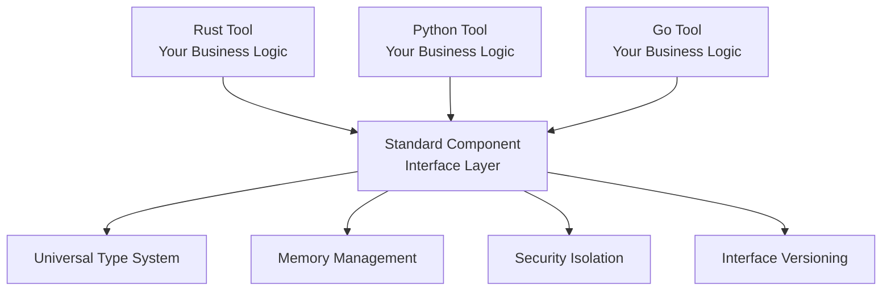
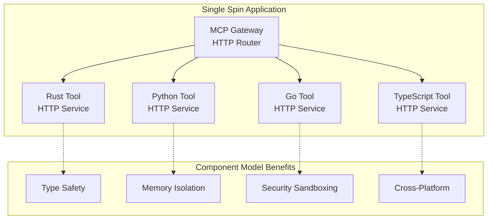

# The Component Model: FTL's Foundation for Polyglot Development

The WebAssembly Component Model is the architectural foundation that enables FTL's seamless polyglot capabilities. Think of it as creating a universal standard for software components - like USB ports that work with any device, the Component Model ensures that a Go component can work alongside Rust, Python, and TypeScript components without friction.

## The Universal Interoperability Problem

Building applications that span multiple programming languages has traditionally been a complex, error-prone endeavor. Each language has its own runtime, memory model, and calling conventions, making integration a constant source of bugs and maintenance overhead.

FTL solves this through the WebAssembly Component Model - a standardized way to build composable, language-agnostic software components. By leveraging this standard through the Fermyon Spin framework, FTL transforms the "polyglot problem" from a technical challenge into a superpower.

## What You'll Learn

- **The Problem**: Why traditional language interop is painful and fragile
- **The Solution**: How the Component Model creates universal compatibility 
- **FTL's Approach**: How we deliver Component Model benefits through practical abstractions
- **Real Examples**: Actual multi-language development workflows with FTL
- **The Benefits**: What this means for your development productivity and application architecture

## The Language Interoperability Problem

Building software that combines multiple programming languages has always been challenging. Each language excels in different domains - Rust for performance, Python for data science, Go for concurrency, JavaScript for web interfaces - but getting them to work together cleanly is notoriously difficult.

### The Old Way: Foreign Function Interfaces (FFI)

Traditional language interop relies on Foreign Function Interfaces, which require manual bridging between incompatible systems:

```c
// C library
int add(int a, int b) { return a + b; }
```

```rust
// Rust calling C - requires unsafe code
extern "C" {
    fn add(a: i32, b: i32) -> i32;
}

unsafe {
    let result = add(5, 3); // One wrong type = crash
}
```

```python  
# Python calling C - platform-specific
import ctypes
lib = ctypes.CDLL('./libmath.so')  # Different on Windows/Mac
lib.add.argtypes = (ctypes.c_int, ctypes.c_int)
lib.add.restype = ctypes.c_int
result = lib.add(5, 3)  # Manual type marshaling
```

### Why FFI Falls Short

**❌ Platform Dependencies**: Different approaches for Linux, macOS, Windows  
**❌ Safety Issues**: Easy to crash with type mismatches or memory errors  
**❌ Complex Marshaling**: Manual conversion between language type systems  
**❌ ABI Fragility**: Binary compatibility breaks across compiler versions  
**❌ Limited Types**: Only primitive types work reliably across boundaries  
**❌ Maintenance Burden**: Each language pair needs custom integration code

### The Real-World Impact

This complexity means teams often resort to:
- **Language Silos**: Entire applications locked into single languages
- **HTTP APIs**: Network overhead just to combine local components
- **Data Serialization**: JSON/XML marshaling for simple function calls
- **Deployment Complexity**: Multiple runtimes, package managers, and dependency chains

The result? Choosing the "best language for the job" becomes impractical because integration costs outweigh language benefits.

## The Component Model Solution

The WebAssembly Component Model fundamentally changes how languages work together by creating a **universal interface standard**. Instead of each language pair needing custom integration code, all languages compile to components that speak the same protocol.

### Key Principles

**Universal Interfaces**: Components define their capabilities using [WebAssembly Interface Types (WIT)](https://component-model.bytecodealliance.org/design/wit.html) - a language-agnostic interface definition language.

**Type Safety**: The Component Model provides compile-time type checking across language boundaries, eliminating entire classes of integration bugs.

**True Portability**: Components run consistently across platforms without platform-specific binding code.

**Near-Native Performance**: WebAssembly execution is close to native speed, without the overhead of JSON serialization or network calls.

**Sandboxed Security**: Each component runs in an isolated environment with explicit capability permissions.

### How It Works (High Level)

It can be worth reading about how [WIT syntax](https://github.com/WebAssembly/component-model/blob/main/design/mvp/WIT.md) and the [Canonical ABI](https://component-model.bytecodealliance.org/design/canonical-abi.html) are foundational pieces in how the component model works, but the key insight is this:



Each language compiles to WebAssembly with standardized interfaces. The Component Model handles all the complexity of:
- Type marshaling between languages
- Memory management across component boundaries  
- Interface versioning and compatibility
- Security isolation and capability control

### Current State (2024-2025)

The Component Model ecosystem is rapidly maturing:
- **WASI 0.2.0**: Released January 2024 with stable component interfaces
- **WASI 0.3**: Expected H1 2025 with native async support
- **Runtime Support**: Wasmtime has full support, other runtimes catching up
- **Tooling**: Growing ecosystem of language bindings and development tools

For the latest technical details, see the official [Component Model documentation](https://component-model.bytecodealliance.org/).

## How FTL Delivers Component Model Benefits

FTL doesn't ask you to learn WIT interfaces or configure WebAssembly components directly. Instead, we leverage the [Fermyon Spin framework](https://www.fermyon.com/spin) to give you all the Component Model benefits through familiar development workflows.

### The FTL Approach: Abstraction Without Complexity

Rather than exposing the full complexity of the Component Model, FTL provides a streamlined developer experience:

**Simple Configuration**: Write `ftl.toml` instead of complex Spin manifests  
**Language-Specific SDKs**: Use familiar patterns in each language  
**Unified Build System**: `ftl build` handles all languages in parallel  
**Single Deployment**: One command deploys your entire polyglot application  

### Spin Framework Integration

Fermyon Spin is a developer framework that makes the Component Model practical for real applications. Spin provides:

- **HTTP Components**: Each tool becomes an HTTP service with WASM runtime
- **Multi-language Support**: Built-in compilation for Rust, Python, Go, JavaScript/TypeScript
- **Component Isolation**: Each language component runs in its own secure sandbox
- **Unified Runtime**: Single server hosting multiple language components

FTL builds on Spin by adding:
- **Configuration Transpilation**: `ftl.toml` → `spin.toml` automatic conversion
- **Parallel Builds**: Simultaneous compilation of all language components  
- **Template System**: Language-specific project templates
- **MCP Protocol Integration**: Standardized tool communication

### Real Architecture: HTTP-Based Microservices

Here's how FTL actually implements polyglot interoperability:



Each language compiles to WebAssembly and runs as an isolated HTTP service within a single Spin application. Communication happens via HTTP/MCP protocol, giving you Component Model benefits (isolation, security, portability) without direct component-to-component calling complexity.

### Local Component Chaining: HTTP Without Network Overhead

A key advantage of Spin's architecture is **local chaining** - when components communicate within the same Spin application, HTTP calls are handled entirely in memory without network overhead:

**Zero Network Latency**: Component-to-component calls never leave the WASM runtime  
**HTTP Protocol Benefits**: Standard REST/JSON interfaces for easy debugging and testing  
**Memory Speed**: In-process communication at native memory speeds  
**Service Mesh Without Complexity**: Get microservices benefits without network infrastructure  

This means you can architect your tools as separate services (great for development, testing, and modularity) while maintaining the performance characteristics of a monolithic application. The HTTP interface makes each component independently testable and debuggable, while Spin's runtime ensures zero network overhead between them.

## Real Example: Building Polyglot Tools with FTL

Let's see how this works in practice by building a text analysis pipeline with multiple languages, each chosen for its strengths.

### Project Setup

```bash
# Initialize a new FTL project
ftl init text-analysis
cd text-analysis

# Add tools in different languages
ftl add text-extractor --language rust        # Rust for performance
ftl add sentiment --language python           # Python for ML libraries  
ftl add summarizer --language go              # Go for concurrency
ftl add formatter --language typescript       # TypeScript for JSON processing
```

### Configuration: ftl.toml

FTL's configuration abstracts away Spin's complexity:

```toml
[project]
name = "text-analysis"
access_control = "public"

[mcp]
gateway = "ghcr.io/fastertools/mcp-gateway:latest"

# Each tool specifies its language and build process
[tools.text-extractor]
path = "text-extractor"
wasm = "text-extractor/target/wasm32-wasip1/release/text_extractor.wasm"
[tools.text-extractor.build]
command = "cargo build --target wasm32-wasip1 --release"

[tools.sentiment]  
path = "sentiment"
wasm = "sentiment/dist/app.wasm"
[tools.sentiment.build]
command = "componentize-py -w spin-http componentize app -o dist/app.wasm"

[tools.summarizer]
path = "summarizer" 
wasm = "summarizer/dist/summarizer.wasm"
[tools.summarizer.build]
command = "tinygo build -target=wasip1 -o dist/summarizer.wasm main.go"

[tools.formatter]
path = "formatter"
wasm = "formatter/dist/formatter.wasm" 
[tools.formatter.build]
command = "npm run build"
```

### Language-Specific Implementations

**Rust Tool** (text-extractor/src/lib.rs):
```rust
use ftl_sdk::{tools, ToolResponse};
use serde::{Deserialize, Serialize};

#[derive(Deserialize)]
struct ExtractInput {
    document: String,
    extract_type: String,
}

#[derive(Serialize)]
struct ExtractResult {
    content: Vec<String>,
    metadata: serde_json::Value,
}

tools! {
    /// Extract structured data from documents using high-performance parsing
    fn extract_text(input: ExtractInput) -> ToolResponse {
        // Fast regex processing in Rust
        let content = match input.extract_type.as_str() {
            "emails" => extract_emails(&input.document),
            "urls" => extract_urls(&input.document),
            "phone" => extract_phones(&input.document),
            _ => vec![]
        };
        
        ToolResponse::json(ExtractResult {
            content,
            metadata: serde_json::json!({"processed_at": chrono::Utc::now()})
        })
    }
}
```

**Python Tool** (sentiment/app.py):
```python
from ftl_sdk import FTL
from transformers import pipeline
import numpy as np

# Leverage Python's ML ecosystem
sentiment_pipeline = pipeline("sentiment-analysis")

ftl = FTL()

@ftl.tool(name="analyze_sentiment")
def analyze_sentiment(text: str) -> dict:
    """Analyze sentiment using state-of-the-art ML models."""
    result = sentiment_pipeline(text)[0]
    
    return {
        "sentiment": result["label"],
        "confidence": float(result["score"]),
        "model": "distilbert-base-uncased-finetuned-sst-2-english"
    }

IncomingHandler = ftl.create_handler()
```

**Go Tool** (summarizer/main.go):
```go
package main

import (
    "context"
    "strings"
    "sync"
    
    ftl "github.com/fastertools/ftl/sdk/go"
)

func init() {
    ftl.CreateTools(map[string]ftl.ToolDefinition{
        "summarize_concurrent": {
            Description: "High-performance concurrent text summarization",
            Handler: func(input map[string]interface{}) ftl.ToolResponse {
                text, _ := input["text"].(string)
                chunks := strings.Split(text, "\n\n")
                
                // Leverage Go's concurrency
                var wg sync.WaitGroup
                summaries := make([]string, len(chunks))
                
                for i, chunk := range chunks {
                    wg.Add(1)
                    go func(idx int, content string) {
                        defer wg.Done()
                        summaries[idx] = summarizeChunk(content)
                    }(i, chunk)
                }
                
                wg.Wait()
                
                return ftl.ToolResponse{
                    Content: []ftl.ToolContent{{
                        Type: "text",
                        Text: strings.Join(summaries, " "),
                    }},
                }
            },
        },
    })
}
```

**TypeScript Tool** (formatter/src/index.ts):
```typescript
import { tools, ToolResponse } from 'ftl-sdk'

interface FormatterInput {
  data: Record<string, any>
  format: 'markdown' | 'html' | 'json'
}

tools({
  formatResults: {
    description: 'Format analysis results with rich output options',
    handler: async (input: FormatterInput): Promise<ToolResponse> => {
      const { data, format } = input
      
      let formatted: string
      
      switch (format) {
        case 'markdown':
          formatted = generateMarkdown(data)
          break
        case 'html': 
          formatted = generateHTML(data)
          break
        case 'json':
          formatted = JSON.stringify(data, null, 2)
          break
      }
      
      return ToolResponse.text(formatted)
    }
  }
})
```

### Build and Deploy

```bash
# Build all languages in parallel
ftl build

# Run locally - single server, all languages
ftl up

# (Optionally) Deploy to production
ftl eng deploy
```

### What Just Happened

1. **Component Model Benefits**: Each language compiles to isolated, secure WASM components
2. **Type Safety**: Tools communicate via well-defined JSON schemas  
3. **Performance**: Local chaining means zero network overhead between tools
4. **Modularity**: Each tool can be developed, tested, and deployed independently
5. **Language Optimization**: Each language handles what it does best

The entire multi-language application runs as a single Spin server, with FTL abstracting away the complexity of WebAssembly component configuration, build orchestration, and HTTP routing.

## The Benefits in Practice

By leveraging the WebAssembly Component Model through Spin, FTL delivers transformative benefits for polyglot development:

### Development Productivity

**Language Choice Freedom**: Pick the best language for each task without integration overhead  
**Familiar Workflows**: Each language uses its natural patterns and tooling  
**Unified Build System**: Single `ftl build` command handles all languages in parallel  
**Fast Iteration**: Local chaining enables instant testing of multi-language workflows  

### Application Architecture

**Microservices Without Complexity**: Get service isolation without network infrastructure  
**Type Safety Across Languages**: JSON schemas ensure compatibility at compile time  
**Security by Default**: Each component runs in an isolated sandbox with explicit permissions  
**True Portability**: Same application runs identically on any platform supporting WASM  

### Operational Excellence  

**Single Runtime**: One server process hosts your entire polyglot application  
**Consistent Deployment**: Same deployment process regardless of language mix  
**Memory Efficiency**: Shared runtime with isolated component memory spaces  
**Performance Optimization**: Near-native execution with zero network overhead between components

### Compared to Traditional Approaches

| Approach | Integration Complexity | Performance | Security | Deployment |
|----------|------------------------|-------------|----------|------------|
| **Microservices** | High (networking, discovery) | Network overhead | Complex (service mesh) | Multiple services |
| **Monorepos** | High (build coordination) | Good | Shared process | Complex polyglot builds |
| **FTL + Component Model** | Low (automatic) | Near-native | Isolated components | Single application |

## What's Next

Now that you understand how FTL leverages the Component Model to make polyglot development practical, explore these areas:

**Architecture Deep Dive**: Learn how components fit into FTL's overall system design → [FTL Architecture](./architecture.md)

**Development Workflow**: Understand the complete project lifecycle from init to production → [Project Lifecycle](./lifecycle.md)  

**Hands-On Tutorial**: Build your first multi-language application → [Getting Started Guide](../getting-started/)

**Component Model Details**: Dive deeper into the technical foundations → [WebAssembly Component Model Documentation](https://component-model.bytecodealliance.org/)

**Spin Framework**: Explore the runtime that makes it all possible → [Fermyon Spin Documentation](https://www.fermyon.com/spin)

---

The WebAssembly Component Model represents a fundamental shift in how we think about language interoperability. FTL makes this shift practical by abstracting the complexity while preserving all the benefits. The result: you can finally choose the best language for each job without paying the integration tax.