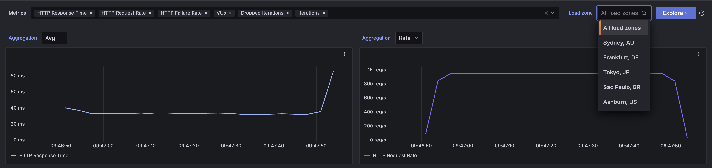

# Why WebAssembly?

fastertools is built entirely on WebAssembly (WASM). This isn't an arbitrary technical choice—it is the core technology that allows us to solve the fundamental challenges of building modern tools necassary to support the growing needs of AI applications. 

To understand why, we first need to define the problem we set out to solve.

## The Real Challenge: Building for the Model Context Protocol (MCP)

The AI ecosystem is standardizing on the Model Context Protocol (MCP) for how AI agents discover and use tools. While this standard is powerful, building a server that correctly implements it is incredibly difficult.

The real challenge is a combination of three complex problems:

- **Protocol & Auth Complexity**: A production-ready MCP server must correctly implement the full protocol specification, including a secure, spec-compliant OAuth flow for authentication. This has proved to be a significant engineering effort in itself.

- **Polyglot Development**: Developers want to write tools in the best language for the job—Python for data science, Rust for high-speed processing, TypeScript for its ecosystem. How do you run all these different languages in a single, cohesive server that presents as one endpoint to the AI model?

- **Deployment & Performance**: AI interactions will demand near-instantaneous response times as models get better and real time applications become more common. How do you package this complex, multi-language application and deploy it so that it has sub-millisecond cold starts and runs efficiently anywhere?

Existing solutions force a choice: you can have one, maybe two of these, but not all three. You could build a single-language server, wrestle with complex and fragile Foreign Function Interfaces (FFIs), or spin up a fleet of slow, heavy containers for each tool.

This is the problem fastertools solves: We provide zero-to-OAuth-authenticated MCP tooling in less than five minutes. WebAssembly is the key that makes this possible.


## How WebAssembly Solves the MCP Challenge
WASM provides a portable, high-performance, and secure compilation target. It addresses each of the core challenges in a way no other technology can.

### Security Through Sandboxing

- **Zero-Trust by Default**: Every WASM module runs in a completely isolated sandbox. It has no access to the file system, network, environment variables, or even system clocks unless the host explicitly grants it that capability.

- **Secure Composition**: A bug or vulnerability in a Python tool cannot affect a Rust tool running alongside it. This allows safer composition of tools/code into a single server process.

This robust, capability-based security is what allows fastertools to handle and execute untrusted user tool code with confidence.

### Performance Through Ahead-of-Time (AOT) Compilation

The latency of an AI agent's response is the sum of the model's thinking time and the tool's execution time. As models get faster, the tools they use are becoming the new performance bottleneck.

- **Near-Native Speed**: WASM is a pre-compiled binary format. There is no interpreter or JIT compiler in the hot path, meaning code runs nearly as fast as native machine code.

- **Sub-Millisecond Cold Starts**: Unlike containers or traditional language runtimes that can take hundreds of milliseconds to initialize, a WASM module can be instantiated and ready to execute in microseconds. This is critical for the "serverless" model of AI tooling.

### Portability and The Component Model

This is the magic that solves the polyglot problem. Standard WASM lets you run one language anywhere. The **WebAssembly Component Model** lets you run *all* languages *together*.

The Component Model defines a stable, language-agnostic Application Binary Interface (ABI). It's like a universal adapter that allows a function written in Rust to seamlessly call a function written in Python as if it were a native function call, with the runtime handling the complex data marshalling behind the scenes.

```bash
// Rust tool
#[tool]
fn process_data(input: String) -> String { ... }

// Python tool
@tool
def analyze_data(data: str) -> str: ...
```

Because of the Component Model, we can compile both of these tools into interoperable components. This unlocks a powerful concept:

### Composition Without Coordination

Tools written by different teams in different languages can now work together without:

- Shared dependencies
- Version conflicts
- Runtime coordination
- Protocol negotiation

This eliminates fragile, hand-written FFIs and slow, network-based communication between services. You simply write your tools, and FTL composes them into a single, high-performance binary that runs identically on your laptop and in the cloud.

## The Force Multiplier: Performance at the Edge

Alright. So we've talked about security, cold start times, portability, and composition and the power they provide.

What happens when you take all of that and leverage a global edge network? Performance results that almost feels like magic--but aren't'.

Because a WASM component is a tiny, self-contained binary, it can be distributed globally and instantiated instantly at the edge location closest to the user or AI agent. This dramatically reduces network latency, which is often the biggest bottleneck in application performance, combined with in-memory process communication results in staggering response times.

### Where the Rubber Meets The Road




As you can see this isn't just theoretical. These are screenshots of a k6 load test against a Python tool, traditionally the slowest of our supported languages, deployed on our FTL Engine. The results speak for themselves:

- Global Average Response Time: 33ms
- Global P95 Response Time: 131ms
- ~56k requests / ~700 requests a second / 0 failures

And these aren't cherry picked. We specifically chose to run this globally targeting a slower language. If it's traffic just in the US/Europe expect 33ms to be closer to the P95.

### Some Perspective

Let's try and put some of these results in perspective. A typical "cold start" for a Python function in a container on a traditional cloud provider can range from 500ms to over 2 seconds.

Lambda generally can be expected to have a cold start time in the 100-200ms range.

Our P95 of 131ms **globally** isn't just an improvement; it's a fundamental change in what's possible.

Results like these are possible because we've eliminated the traditional layers of overhead. There is no container to boot, no OS to virtualize, and no language runtime to initialize. The combination of instant WASM cold starts and reduced network travel time from the edge results in consistently fast global performance that is simply not achievable with other architectures.

