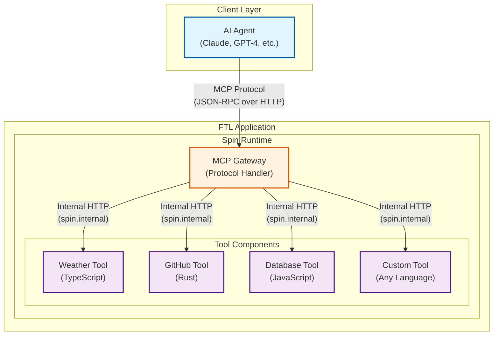

# Overview

The FTL CLI uses the [ftl-mcp](https://github.com/fastertools/ftl-mcp) framework provide an easy DX for developing MCP servers as Wasm components.

### WebAssembly Runtime

FTL is based on the [Spin](https://www.fermyon.com/spin) framework, which embeds the [wasmtime](https://github.com/bytecodealliance/wasmtime) runtime, providing:
- Secure sandboxing for each component
- Host-level in-memory interop between components (no network calls across components within an app)
- Fast cold starts and execution
- Runs on any WASI-compatible host (including your local machine)

## Architecture Overview

The architecture consists of:

1. **MCP Gateway**: A WebAssembly component that:
   - Receives MCP protocol requests (JSON-RPC over HTTP)
   - Validates and routes requests to appropriate tool components
   - Aggregates tool metadata for discovery
   - Handles protocol translation and error responses

2. **Tool Components**: Individual WebAssembly modules that:
   - Implement specific MCP tool functionality
   - Run in isolated sandboxes for security
   - Communicate via Spin's internal HTTP router (no external network)
   - Can be written in any language that compiles to WebAssembly

### Key Architectural Benefits:

- **Protocol Separation**: The MCP Gateway handles all protocol complexity, allowing tools to focus on business logic
- **Language Flexibility**: Write tools in Rust, TypeScript, JavaScript, Python, Go, or any language that targets WebAssembly
- **Security Isolation**: Each component runs in its own WebAssembly sandbox with capability-based security
- **Zero Network Overhead**: Components communicate via memory-mapped HTTP within the Spin runtime
- **Independent Deployment**: Tools can be developed, tested, and versioned independently
- **Registry Distribution**: Share tools via OCI registries (ghcr.io, Docker Hub, etc.)

## Why FTL?

### For MCP Developers

- **Language Choice**: Use your preferred language (Rust, TypeScript, JavaScript)
- **Fast Iteration**: Hot reload with `ftl watch` for rapid development
- **Easy Testing**: Built-in test runners for each language
- **Simple Deployment**: One command to build and deploy

### For AI Applications

- **Composability**: Mix and match components from different sources
- **Performance**: WebAssembly provides near-native execution speed
- **Security**: Components run in isolated sandboxes
- **Portability**: Deploy anywhere - edge, cloud, or on-premise

### For Teams

- **Component Distribution**: Share MCP components via OCI registries
- **Independent Development**: Teams can work on components separately
- **Unified Deployment**: Compose components into cohesive applications

## Getting Started

Ready to build your first MCP component? Continue to the [Quick Start Guide](./quickstart.md) or dive into the [CLI Reference](./cli-reference.md).

## Learn More

- [Model Context Protocol](https://modelcontextprotocol.io) - The protocol specification
- [Spin Documentation](https://developer.fermyon.com/spin) - The WebAssembly runtime
- [WebAssembly Component Model](https://component-model.bytecodealliance.org/) - The component standard