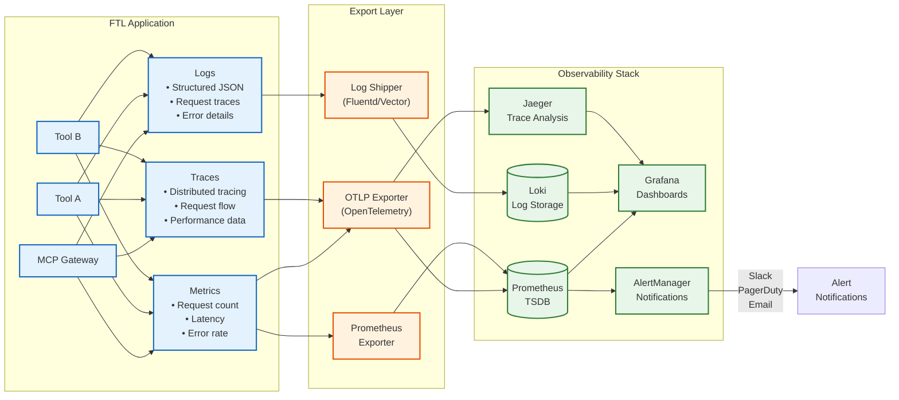

# Monitoring Guide

This guide covers monitoring, observability, and operational insights for FTL applications in production.

## Overview

Effective monitoring helps you:
- Detect and diagnose issues quickly
- Understand system performance
- Track usage patterns
- Ensure SLA compliance
- Plan capacity

## Monitoring Architecture



### Observability Signals

1. **Metrics**: Numerical measurements over time (counters, gauges, histograms)
2. **Logs**: Structured event records with context
3. **Traces**: Request flow across components
4. **Profiles**: CPU and memory usage snapshots

## Metrics Collection

### Built-in Metrics

FTL and Spin provide these metrics out of the box:

| Metric | Type | Description |
|--------|------|-------------|
| `http_requests_total` | Counter | Total HTTP requests |
| `http_request_duration_seconds` | Histogram | Request latency |
| `http_request_size_bytes` | Histogram | Request body size |
| `http_response_size_bytes` | Histogram | Response body size |
| `wasm_execution_duration_seconds` | Histogram | Component execution time |
| `wasm_memory_usage_bytes` | Gauge | Memory consumption |

### Custom Metrics

Add custom metrics to your tools:

```typescript
// TypeScript example
import { metrics } from 'ftl-sdk';

const processedItems = metrics.counter('items_processed_total', {
  help: 'Total number of items processed'
});

const processingTime = metrics.histogram('processing_duration_seconds', {
  help: 'Time spent processing items',
  buckets: [0.1, 0.5, 1, 2, 5]
});

export async function handler(input: Input) {
  const timer = processingTime.startTimer();
  
  try {
    // Process item
    const result = await processItem(input);
    processedItems.inc({ status: 'success' });
    return result;
  } catch (error) {
    processedItems.inc({ status: 'error' });
    throw error;
  } finally {
    timer();
  }
}
```

### Prometheus Configuration

Configure Prometheus export in `spin.toml`:

```toml
[component.mcp-gateway]
environment = {
  OTEL_EXPORTER_OTLP_ENDPOINT = "http://localhost:4317",
  OTEL_SERVICE_NAME = "ftl-mcp-gateway",
  OTEL_METRICS_EXPORTER = "prometheus"
}

[[trigger.http]]
route = "/metrics"
component = "prometheus-exporter"
```

Prometheus scrape configuration:

```yaml
scrape_configs:
  - job_name: 'ftl-app'
    static_configs:
      - targets: ['ftl-app:3000']
    metrics_path: '/metrics'
    scrape_interval: 15s
```

## Logging

### Structured Logging

Use structured logging for better searchability:

```typescript
// Good: Structured logging
logger.info('Tool execution completed', {
  tool: 'weather',
  duration_ms: 234,
  location: 'San Francisco',
  status: 'success'
});

// Bad: Unstructured logging
console.log(`Weather tool took 234ms for San Francisco`);
```

### Log Levels

Configure appropriate log levels:

```bash
# Development
export RUST_LOG=debug
export SPIN_LOG=trace

# Production
export RUST_LOG=info
export SPIN_LOG=warn
```

### Log Aggregation

Configure log shipping to centralized system:

```toml
# spin.toml
[component.my-tool]
environment = {
  LOG_FORMAT = "json",
  LOG_DESTINATION = "stdout"
}
```

Example Fluentd configuration:

```ruby
<source>
  @type forward
  port 24224
</source>

<filter ftl.**>
  @type parser
  key_name log
  format json
</filter>

<match ftl.**>
  @type elasticsearch
  host elasticsearch
  port 9200
  index_name ftl-logs
</match>
```

## Distributed Tracing

### OpenTelemetry Setup

Enable tracing in your components:

```typescript
import { trace } from '@opentelemetry/api';

const tracer = trace.getTracer('my-tool');

export async function handler(input: Input) {
  const span = tracer.startSpan('process-request');
  
  try {
    span.setAttribute('tool.name', 'my-tool');
    span.setAttribute('input.type', typeof input);
    
    const result = await processWithTracing(input, span);
    span.setStatus({ code: SpanStatusCode.OK });
    return result;
  } catch (error) {
    span.recordException(error);
    span.setStatus({ code: SpanStatusCode.ERROR });
    throw error;
  } finally {
    span.end();
  }
}
```

### Jaeger Integration

Configure Jaeger exporter:

```toml
[component.mcp-gateway]
environment = {
  OTEL_TRACES_EXPORTER = "jaeger",
  OTEL_EXPORTER_JAEGER_ENDPOINT = "http://jaeger:14268/api/traces",
  OTEL_SERVICE_NAME = "ftl-app"
}
```

## Health Checks

### Implementing Health Endpoints

Add health check endpoints to your application:

```typescript
// Health check component
export async function handler(request: Request): Promise<Response> {
  const checks = await Promise.all([
    checkDatabase(),
    checkExternalAPI(),
    checkMemoryUsage()
  ]);
  
  const allHealthy = checks.every(c => c.status === 'healthy');
  
  return new Response(JSON.stringify({
    status: allHealthy ? 'healthy' : 'unhealthy',
    checks: checks,
    timestamp: new Date().toISOString()
  }), {
    status: allHealthy ? 200 : 503,
    headers: { 'Content-Type': 'application/json' }
  });
}
```

Configure in `spin.toml`:

```toml
[[trigger.http]]
route = "/health"
component = "health-check"

[[trigger.http]]
route = "/ready"
component = "readiness-check"
```

## Dashboards

### Grafana Dashboard

Example dashboard JSON for FTL applications:

```json
{
  "dashboard": {
    "title": "FTL Application Monitoring",
    "panels": [
      {
        "title": "Request Rate",
        "targets": [{
          "expr": "rate(http_requests_total[5m])"
        }]
      },
      {
        "title": "Request Duration (p95)",
        "targets": [{
          "expr": "histogram_quantile(0.95, rate(http_request_duration_seconds_bucket[5m]))"
        }]
      },
      {
        "title": "Error Rate",
        "targets": [{
          "expr": "rate(http_requests_total{status=~'5..'}[5m])"
        }]
      },
      {
        "title": "Memory Usage",
        "targets": [{
          "expr": "wasm_memory_usage_bytes"
        }]
      }
    ]
  }
}
```

### Key Metrics to Monitor

1. **Golden Signals**
   - **Latency**: Response time percentiles (p50, p95, p99)
   - **Traffic**: Requests per second
   - **Errors**: Error rate and types
   - **Saturation**: CPU, memory, I/O usage

2. **Business Metrics**
   - Tool usage by type
   - User engagement
   - Success/failure rates
   - API quota usage

## Alerting

### Alert Rules

Example Prometheus alert rules:

```yaml
groups:
  - name: ftl-alerts
    rules:
      - alert: HighErrorRate
        expr: rate(http_requests_total{status=~"5.."}[5m]) > 0.05
        for: 5m
        labels:
          severity: critical
        annotations:
          summary: "High error rate detected"
          description: "Error rate is {{ $value }} errors per second"
      
      - alert: HighLatency
        expr: histogram_quantile(0.95, rate(http_request_duration_seconds_bucket[5m])) > 2
        for: 10m
        labels:
          severity: warning
        annotations:
          summary: "High request latency"
          description: "95th percentile latency is {{ $value }} seconds"
      
      - alert: HighMemoryUsage
        expr: wasm_memory_usage_bytes > 1073741824  # 1GB
        for: 5m
        labels:
          severity: warning
        annotations:
          summary: "High memory usage"
          description: "Memory usage is {{ $value | humanize }}"
```

### Notification Channels

Configure alerting channels:

```yaml
# alertmanager.yml
route:
  receiver: 'team-slack'
  group_by: ['alertname', 'cluster']
  group_wait: 10s
  group_interval: 10s
  repeat_interval: 1h

receivers:
  - name: 'team-slack'
    slack_configs:
      - api_url: 'YOUR_SLACK_WEBHOOK_URL'
        channel: '#alerts'
        title: 'FTL Alert'
        text: '{{ range .Alerts }}{{ .Annotations.summary }}{{ end }}'
```

## Performance Monitoring

### Profiling

Enable CPU and memory profiling:

```toml
[component.my-tool]
environment = {
  ENABLE_PROFILING = "true",
  PROFILE_FREQUENCY = "100"  # Hz
}
```

Access profiles:

```bash
# CPU profile
curl http://localhost:3000/debug/pprof/profile?seconds=30 > cpu.prof

# Memory profile
curl http://localhost:3000/debug/pprof/heap > heap.prof
```

### Benchmarking

Regular benchmarking script:

```bash
#!/bin/bash
# benchmark.sh

echo "Running FTL benchmarks..."

# Warm up
ab -n 1000 -c 10 http://localhost:3000/mcp

# Actual benchmark
ab -n 10000 -c 50 -g results.tsv http://localhost:3000/mcp

# Generate report
gnuplot << EOF
set terminal png
set output 'benchmark.png'
set title 'Response Time Distribution'
set xlabel 'Requests'
set ylabel 'Response Time (ms)'
plot 'results.tsv' using 9 with lines title 'Response Time'
EOF
```

## Production Checklist

### Pre-Production

- [ ] Metrics endpoints configured
- [ ] Logging configured with appropriate levels
- [ ] Health checks implemented
- [ ] Tracing enabled for critical paths
- [ ] Dashboards created
- [ ] Alert rules defined
- [ ] Runbooks documented

### Production Deployment

- [ ] Monitoring endpoints accessible
- [ ] Metrics being collected
- [ ] Logs being shipped
- [ ] Alerts configured
- [ ] Dashboard access granted
- [ ] On-call rotation set up

### Operational Excellence

- [ ] Regular review of metrics
- [ ] Alert tuning based on false positives
- [ ] Capacity planning reviews
- [ ] Performance optimization based on data
- [ ] Incident post-mortems

## Troubleshooting Monitoring

### No Metrics Appearing

1. Check endpoint accessibility:
   ```bash
   curl http://localhost:3000/metrics
   ```

2. Verify Prometheus configuration:
   ```bash
   curl http://localhost:9090/api/v1/targets
   ```

3. Check component logs:
   ```bash
   ftl up --verbose
   ```

### Missing Traces

1. Verify OTLP endpoint:
   ```bash
   nc -zv localhost 4317
   ```

2. Check trace sampling rate:
   ```toml
   OTEL_TRACES_SAMPLER = "always_on"
   ```

### Log Shipping Issues

1. Check log format:
   ```bash
   ftl up 2>&1 | jq .
   ```

2. Verify network connectivity to log aggregator

## Tools and Resources

### Monitoring Stack

- **Metrics**: Prometheus + Grafana
- **Logs**: ELK Stack or Loki
- **Traces**: Jaeger or Tempo
- **APM**: DataDog, New Relic, or AppDynamics

### Useful Commands

```bash
# Check component metrics
curl http://localhost:3000/metrics | grep -E "^[^#]"

# View recent logs
journalctl -u ftl-app -n 100 -f

# Test trace export
OTEL_TRACES_EXPORTER=console ftl up

# Memory usage analysis
ps aux | grep ftl | awk '{print $6}'
```

### References

- [OpenTelemetry Documentation](https://opentelemetry.io/docs/)
- [Prometheus Best Practices](https://prometheus.io/docs/practices/)
- [Grafana Dashboard Guide](https://grafana.com/docs/grafana/latest/dashboards/)
- [Spin Observability](https://developer.fermyon.com/spin/observability)