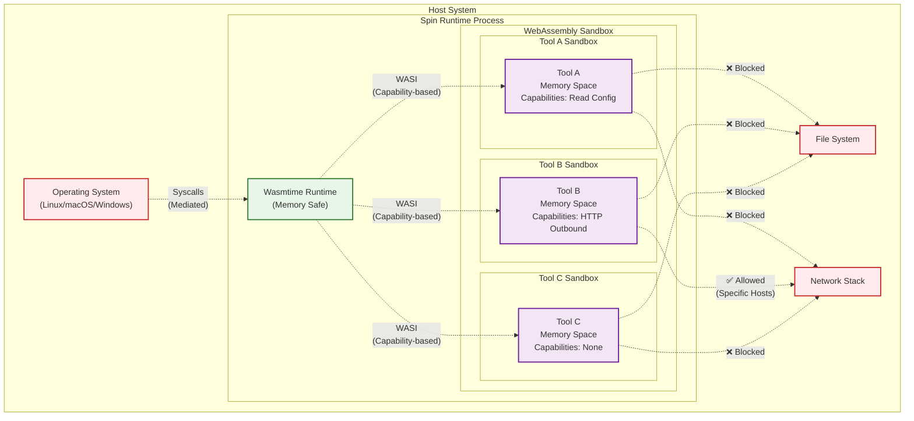

# Security Guide

This guide covers security best practices for developing and deploying FTL applications. Security is a shared responsibility between the FTL framework, the Spin runtime, and your application code.

## Security Architecture

### WebAssembly Sandbox

FTL leverages WebAssembly's security model:



### Security Layers

1. **Process Isolation**: The Spin runtime runs as a separate OS process
2. **Runtime Safety**: Wasmtime provides memory-safe execution
3. **Sandbox Isolation**: Each tool runs in its own WebAssembly sandbox
4. **Capability-Based Access**: Tools only get explicitly granted permissions
5. **Resource Limits**: CPU, memory, and execution time can be constrained

**Key Security Features**:
- **Memory Isolation**: Each component has its own linear memory
- **No Direct System Access**: Components can't access host filesystem or network directly
- **Capability-Based Security**: Components only get explicitly granted capabilities
- **Resource Limits**: CPU and memory usage can be constrained

## Development Security

### Input Validation

Always validate and sanitize inputs:

```typescript
// Good: Validate inputs
import { z } from 'zod';

const InputSchema = z.object({
  email: z.string().email(),
  age: z.number().min(0).max(150),
  url: z.string().url()
});

// Bad: Trust user input
function processUser(input: any) {
  // Never do this!
  eval(input.code);
}
```

### Secret Management

**Never hardcode secrets in your code!**

```typescript
// Bad: Hardcoded secrets
const API_KEY = "sk-1234567890abcdef";

// Good: Use environment variables
const API_KEY = process.env.API_KEY;
if (!API_KEY) {
  throw new Error("API_KEY environment variable required");
}
```

Configure secrets in `spin.toml`:

```toml
[component.my-tool]
environment = { API_KEY = "{{ secrets.api_key }}" }
```

### Error Handling

Don't expose internal details in errors:

```rust
// Bad: Exposing internal paths
return Err(format!("Failed to read /home/user/data/secrets.db: {}", e));

// Good: Generic error messages
return Err("Failed to process request. Please try again.".into());

// Log detailed errors internally
log::error!("Database error at secrets.db: {}", e);
```

## Network Security

### HTTPS Only

Always use HTTPS for external communications:

```typescript
// Bad: HTTP endpoint
const response = await fetch('http://api.example.com/data');

// Good: HTTPS endpoint
const response = await fetch('https://api.example.com/data');
```

### API Authentication

Implement proper authentication for external APIs:

```typescript
// Good: Bearer token authentication
const response = await fetch('https://api.example.com/data', {
  headers: {
    'Authorization': `Bearer ${token}`,
    'Content-Type': 'application/json'
  }
});
```

### Internal Communication

Use Spin's internal networking for component communication:

```typescript
// Secure: Internal communication only
const response = await fetch('http://other-tool.spin.internal/');

// Never expose internal endpoints externally
```

## Data Security

### Encryption at Rest

For sensitive data storage:

```rust
use aes_gcm::{Aes256Gcm, Key, Nonce};
use aes_gcm::aead::{Aead, NewAead};

fn encrypt_data(data: &[u8], key: &[u8]) -> Result<Vec<u8>, Error> {
    let key = Key::from_slice(key);
    let cipher = Aes256Gcm::new(key);
    let nonce = Nonce::from_slice(b"unique nonce"); // Use random nonce
    
    cipher.encrypt(nonce, data)
        .map_err(|e| Error::Encryption(e.to_string()))
}
```

### Data Sanitization

Clean sensitive data from logs and responses:

```typescript
function sanitizeUser(user: User): SanitizedUser {
  const { password, ssn, creditCard, ...safe } = user;
  return safe;
}

// Log safe data only
console.log('User action:', sanitizeUser(user));
```

## Authentication & Authorization

### Implementing Auth Gateway

Use the ftl-auth-gateway for authentication:

```bash
ftl add auth --template ftl-auth-gateway
```

Configure in `spin.toml`:

```toml
[[trigger.http]]
route = "/auth/..."
component = "auth-gateway"

[component.auth-gateway.variables]
workos_api_key = "{{ secrets.workos_api_key }}"
workos_client_id = "{{ secrets.workos_client_id }}"
redirect_uri = "https://yourdomain.com/auth/callback"
```

### Role-Based Access Control

Implement RBAC in your tools:

```typescript
interface AuthContext {
  userId: string;
  roles: string[];
  permissions: string[];
}

function requirePermission(ctx: AuthContext, permission: string) {
  if (!ctx.permissions.includes(permission)) {
    throw new Error('Insufficient permissions');
  }
}

// In your tool handler
handler: async (input, context: AuthContext) => {
  requirePermission(context, 'tools:write');
  // Proceed with authorized action
}
```

## Security Headers

Configure security headers in `spin.toml`:

```toml
[component.mcp-gateway]
environment = {
  ALLOWED_ORIGINS = "https://trusted-domain.com",
  CSP_POLICY = "default-src 'self'; script-src 'none'",
  HSTS_ENABLED = "true"
}
```

Implement in your gateway:

```typescript
function addSecurityHeaders(response: Response): Response {
  response.headers.set('X-Content-Type-Options', 'nosniff');
  response.headers.set('X-Frame-Options', 'DENY');
  response.headers.set('X-XSS-Protection', '1; mode=block');
  response.headers.set('Strict-Transport-Security', 'max-age=31536000');
  return response;
}
```

## Vulnerability Management

### Dependency Scanning

Regularly scan dependencies:

```bash
# Rust
cargo audit

# TypeScript/JavaScript
npm audit
```

### Automated Security Updates

Use Dependabot in `.github/dependabot.yml`:

```yaml
version: 2
updates:
  - package-ecosystem: "cargo"
    directory: "/"
    schedule:
      interval: "weekly"
  - package-ecosystem: "npm"
    directory: "/my-tool"
    schedule:
      interval: "weekly"
```

## Production Security Checklist

### Pre-Deployment

- [ ] No hardcoded secrets or credentials
- [ ] All inputs validated and sanitized
- [ ] Error messages don't expose internals
- [ ] Dependencies scanned and updated
- [ ] Security headers configured
- [ ] HTTPS enforced for external calls
- [ ] Authentication implemented (if required)
- [ ] Logs don't contain sensitive data

### Deployment

- [ ] Use secure registry for components
- [ ] Enable access logs and monitoring
- [ ] Configure rate limiting
- [ ] Set up DDoS protection
- [ ] Implement backup strategy
- [ ] Configure incident response plan

### Post-Deployment

- [ ] Monitor for suspicious activity
- [ ] Regular security audits
- [ ] Keep dependencies updated
- [ ] Review access logs
- [ ] Test incident response procedures

## Security Policies

### Secrets Rotation

Implement regular secret rotation:

```typescript
// Check secret age
const SECRET_MAX_AGE_DAYS = 90;

function checkSecretAge(secretDate: Date): boolean {
  const age = Date.now() - secretDate.getTime();
  const days = age / (1000 * 60 * 60 * 24);
  return days > SECRET_MAX_AGE_DAYS;
}
```

### Access Control

Implement least privilege principle:

```toml
# spin.toml - Limit component capabilities
[component.my-tool]
allowed_http_hosts = ["api.example.com"]
files = []  # No filesystem access
```

## Incident Response

### Security Issue Reporting

Report security vulnerabilities to: security@fastertools.com

**Do NOT**:
- Open public issues for security vulnerabilities
- Share vulnerability details publicly

**Do**:
- Email security team with details
- Allow 90 days for patch before disclosure
- Include steps to reproduce

### Response Plan

1. **Identify**: Detect and confirm the security issue
2. **Contain**: Limit the impact and prevent spread
3. **Eradicate**: Remove the threat
4. **Recover**: Restore normal operations
5. **Review**: Document lessons learned

## Compliance

### Data Privacy

Implement GDPR/CCPA compliance:

```typescript
// Data retention
const DATA_RETENTION_DAYS = 365;

// Right to deletion
async function deleteUserData(userId: string) {
  await database.deleteUser(userId);
  await logs.anonymize(userId);
  await cache.purge(userId);
}

// Data export
async function exportUserData(userId: string): Promise<UserData> {
  return {
    profile: await database.getUser(userId),
    activities: await logs.getUserActivities(userId),
    preferences: await cache.getUserPreferences(userId)
  };
}
```

### Audit Logging

Maintain audit trails:

```typescript
interface AuditLog {
  timestamp: Date;
  userId: string;
  action: string;
  resource: string;
  result: 'success' | 'failure';
  metadata?: Record<string, any>;
}

function logAudit(entry: AuditLog) {
  // Store in append-only log
  console.log(JSON.stringify({
    ...entry,
    timestamp: entry.timestamp.toISOString()
  }));
}
```

## Additional Resources

- [OWASP Security Guidelines](https://owasp.org/)
- [WebAssembly Security Model](https://webassembly.org/docs/security/)
- [Spin Security Documentation](https://developer.fermyon.com/spin/security)
- [MCP Security Considerations](https://modelcontextprotocol.io/docs/concepts/security)

## Security Tools

Recommended security tools:

- **Static Analysis**: `cargo-audit`, `npm audit`
- **Dependency Scanning**: Snyk, Dependabot
- **Runtime Protection**: Spin's built-in sandboxing
- **Monitoring**: Prometheus + Grafana
- **Log Analysis**: ELK stack or similar