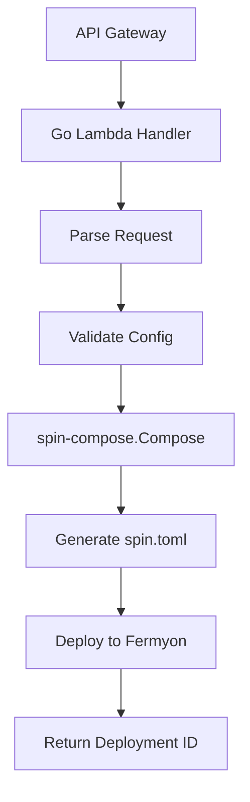

# Backend Lambda Implementation in Go

## Using spin-compose as a Library

Since the backend is using Go lambdas, they can import spin-compose directly as a library instead of shelling out to a binary!

## Lambda Handler Implementation

```go
package main

import (
    "context"
    "encoding/json"
    "fmt"
    "strings"
    
    "github.com/aws/aws-lambda-go/events"
    "github.com/aws/aws-lambda-go/lambda"
    "github.com/google/uuid"
    
    // Import spin-compose as a library
    spincompose "github.com/fastertools/ftl-cli/go/spin-compose/lib"
    "github.com/fastertools/ftl-cli/go/shared/config"
)

// DeploymentRequest matches the API schema
type DeploymentRequest struct {
    Config      config.FTLConfig             `json:"config"`
    Components  []config.ComponentReference  `json:"components"`
    Environment string                       `json:"environment,omitempty"`
}

// DeploymentResponse matches the API schema
type DeploymentResponse struct {
    DeploymentID string `json:"deployment_id"`
    Status       string `json:"status"`
    Message      string `json:"message,omitempty"`
    AppURL       string `json:"app_url,omitempty"`
}

// Global platform overlay configuration
var platformOverlay = &config.FTLConfig{
    Components: []config.ComponentConfig{
        {
            ID:     "mcp-gateway",
            Source: "platform.ecr.amazonaws.com/ftl-platform/mcp-gateway:v2.1.0",
            Environment: map[string]string{
                "TELEMETRY_ENDPOINT": "https://telemetry.ftl.dev",
            },
        },
        {
            ID:     "mcp-authorizer",  
            Source: "platform.ecr.amazonaws.com/ftl-platform/mcp-authorizer:v2.1.0",
            Environment: map[string]string{
                "AUTH_ENABLED": "{{ mcp.authorizer.enabled }}",
                "ACCESS_CONTROL": "{{ mcp.authorizer.access_control }}",
            },
        },
    },
    Triggers: []config.TriggerConfig{
        {
            Type:      "http",
            Route:     "/*",
            Component: "mcp-gateway",
        },
    },
}

func handleDeployment(ctx context.Context, request events.APIGatewayProxyRequest) (events.APIGatewayProxyResponse, error) {
    // Parse request body
    var deployReq DeploymentRequest
    if err := json.Unmarshal([]byte(request.Body), &deployReq); err != nil {
        return errorResponse(400, "Invalid request body")
    }
    
    // Validate the user config
    if err := deployReq.Config.Validate(); err != nil {
        return errorResponse(400, fmt.Sprintf("Invalid configuration: %v", err))
    }
    
    // Generate deployment ID
    deploymentID := uuid.New().String()
    
    // Create composer instance
    composer := spincompose.New()
    
    // Prepare variables from MCP config
    variables := map[string]string{
        "environment": deployReq.Environment,
        "deployment_id": deploymentID,
    }
    
    // Extract MCP config values for variable substitution
    if deployReq.Config.MCP != nil && deployReq.Config.MCP.Authorizer != nil {
        variables["mcp.authorizer.enabled"] = fmt.Sprintf("%v", deployReq.Config.MCP.Authorizer.Enabled)
        variables["mcp.authorizer.access_control"] = deployReq.Config.MCP.Authorizer.AccessControl
        
        if deployReq.Config.MCP.Authorizer.JWTIssuer != "" {
            platformOverlay.Components[1].Environment["JWT_ISSUER"] = deployReq.Config.MCP.Authorizer.JWTIssuer
        }
    }
    
    // Synthesize the final spin.toml
    spinToml, err := composer.Compose(
        spincompose.WithConfigStruct(&deployReq.Config),
        spincompose.WithOverlayStruct(platformOverlay),
        spincompose.WithVariables(variables),
    )
    if err != nil {
        return errorResponse(500, fmt.Sprintf("Failed to synthesize configuration: %v", err))
    }
    
    // Deploy to Fermyon Cloud
    appURL, err := deployToFermyon(ctx, deploymentID, spinToml, deployReq.Config.Application.Name)
    if err != nil {
        return errorResponse(500, fmt.Sprintf("Failed to deploy: %v", err))
    }
    
    // Return success response
    response := DeploymentResponse{
        DeploymentID: deploymentID,
        Status:       "deploying",
        Message:      "Deployment initiated successfully",
        AppURL:       appURL,
    }
    
    body, _ := json.Marshal(response)
    return events.APIGatewayProxyResponse{
        StatusCode: 202,
        Headers: map[string]string{
            "Content-Type": "application/json",
        },
        Body: string(body),
    }, nil
}

func deployToFermyon(ctx context.Context, deploymentID, spinToml, appName string) (string, error) {
    // TODO: Implement Fermyon deployment
    // 1. Call Fermyon Cloud API
    // 2. Upload spin.toml
    // 3. Get deployment URL
    
    return fmt.Sprintf("https://%s.ftl.dev", appName), nil
}

func errorResponse(statusCode int, message string) (events.APIGatewayProxyResponse, error) {
    body, _ := json.Marshal(map[string]string{
        "error": message,
    })
    
    return events.APIGatewayProxyResponse{
        StatusCode: statusCode,
        Headers: map[string]string{
            "Content-Type": "application/json",
        },
        Body: string(body),
    }, nil
}

func main() {
    lambda.Start(handleDeployment)
}
```

## Deployment Package Structure

```
lambda-deployment/
├── go.mod
├── go.sum
├── main.go
├── platform/
│   └── overlays/
│       ├── production.yaml
│       ├── staging.yaml
│       └── development.yaml
└── Makefile
```

## go.mod

```go
module github.com/ftl-platform/deployment-lambda

go 1.21

require (
    github.com/aws/aws-lambda-go v1.41.0
    github.com/fastertools/ftl-cli/go/spin-compose v0.1.0
    github.com/fastertools/ftl-cli/go/shared v0.1.0
    github.com/google/uuid v1.5.0
)

// For local development, use replace directive
// replace github.com/fastertools/ftl-cli/go/spin-compose => ../ftl-cli/go/spin-compose
// replace github.com/fastertools/ftl-cli/go/shared => ../ftl-cli/go/shared
```

## Makefile

```makefile
.PHONY: build test deploy

build:
	GOOS=linux GOARCH=amd64 go build -o bootstrap main.go
	zip deployment.zip bootstrap

test:
	go test -v ./...

deploy: build
	aws lambda update-function-code \
		--function-name ftl-deployment-handler \
		--zip-file fileb://deployment.zip

local-test:
	go run main.go
```

## Benefits of Using spin-compose as a Library

1. **No Binary Management** - No need to bundle spin-compose binary in Lambda
2. **Direct Integration** - Call functions directly, no subprocess overhead
3. **Type Safety** - Compile-time checking of configuration structures
4. **Better Error Handling** - Go errors instead of parsing stderr
5. **Smaller Lambda Package** - Just compiled Go code, no extra binaries
6. **Easier Testing** - Can unit test with mocks
7. **Shared Types** - Use the same config structs everywhere

## Environment-Specific Overlays

The Lambda can load different overlays based on environment:

```go
func getPlatformOverlay(environment string) *config.FTLConfig {
    switch environment {
    case "production":
        return &config.FTLConfig{
            Components: []config.ComponentConfig{
                {
                    ID:     "mcp-gateway",
                    Source: "platform.ecr.amazonaws.com/ftl-platform/mcp-gateway:v2.1.0",
                    // Production config
                },
            },
        }
    case "staging":
        return &config.FTLConfig{
            Components: []config.ComponentConfig{
                {
                    ID:     "mcp-gateway",
                    Source: "platform.ecr.amazonaws.com/ftl-platform/mcp-gateway:staging",
                    // Staging config
                },
            },
        }
    default:
        // Development config
        return &config.FTLConfig{
            // ...
        }
    }
}
```

## Testing

```go
func TestDeploymentHandler(t *testing.T) {
    // Create test request
    userConfig := &config.FTLConfig{
        Application: config.ApplicationConfig{
            Name: "test-app",
            Version: "1.0.0",
        },
        Components: []config.ComponentConfig{
            {
                ID: "my-tool",
                Source: "test.registry.com/my-tool:v1",
            },
        },
    }
    
    // Test synthesis
    composer := spincompose.New()
    result, err := composer.Compose(
        spincompose.WithConfigStruct(userConfig),
        spincompose.WithOverlayStruct(platformOverlay),
    )
    
    assert.NoError(t, err)
    assert.Contains(t, result, "mcp-gateway")
    assert.Contains(t, result, "my-tool")
}
```

## Deployment Flow



This approach is much cleaner and more maintainable than shelling out to a binary!