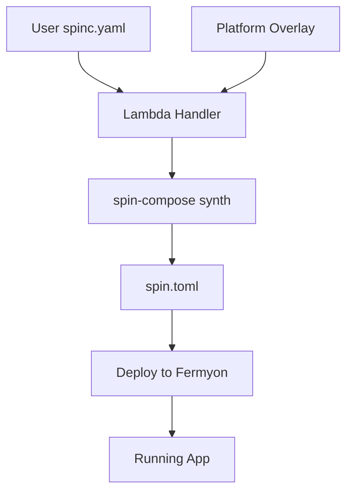

# Complete Integration Example

## Files Involved

### 1. User's spinc.yaml (sent in deployment request)
```yaml
application:
  name: weather-app
  version: 1.0.0

components:
  - id: weather-tool
    source: 123456789.dkr.ecr.us-west-2.amazonaws.com/ftl/app-abc/weather-tool:v1.0.0
    allowed_outbound_hosts:
      - "https://api.weather.com"
    environment:
      LOG_LEVEL: "info"

triggers:
  - type: http
    route: "/api/weather/*"
    component: weather-tool

mcp:
  authorizer:
    enabled: true
    access_control: private
```

### 2. Platform Overlay (platform-components.yaml - maintained by backend)
```yaml
# Platform components to inject
components:
  - id: mcp-gateway
    source: platform.ecr.amazonaws.com/ftl-platform/mcp-gateway:v2.1.0
    environment:
      DOWNSTREAM_COMPONENTS: "weather-tool"
      TELEMETRY_ENDPOINT: "https://telemetry.ftl.dev"
      
  - id: mcp-authorizer
    source: platform.ecr.amazonaws.com/ftl-platform/mcp-authorizer:v2.1.0
    environment:
      AUTH_ENABLED: "true"
      ACCESS_CONTROL: "private"
      JWT_ISSUER: "https://divine-lion-50-staging.authkit.app"
      ALLOWED_AUDIENCES: "ftl-platform"
      
  - id: telemetry-collector
    source: platform.ecr.amazonaws.com/ftl-platform/telemetry:v1.0.0
    environment:
      OTEL_EXPORTER_ENDPOINT: "https://otel.ftl.dev"

# Override triggers to route through gateway
triggers:
  - type: http
    route: "/*"
    component: mcp-gateway
```

### 3. Lambda Handler (Python example)
```python
import json
import subprocess
import tempfile
import os
from pathlib import Path

def handle_deployment(event, context):
    """
    Handle /v1/deployments POST request
    """
    # Parse request body
    body = json.loads(event['body'])
    user_config = body['config']
    component_refs = body['components']
    environment = body.get('environment', 'production')
    
    # Create temp directory for configs
    with tempfile.TemporaryDirectory() as tmpdir:
        # Write user config
        user_config_path = Path(tmpdir) / "user.yaml"
        with open(user_config_path, 'w') as f:
            yaml.dump(user_config, f)
        
        # Write platform overlay
        platform_config_path = Path(tmpdir) / "platform.yaml"
        with open(platform_config_path, 'w') as f:
            f.write(PLATFORM_OVERLAY_TEMPLATE)
        
        # Output path for spin.toml
        output_path = Path(tmpdir) / "spin.toml"
        
        # Run spin-compose
        cmd = [
            '/opt/bin/spin-compose',
            'synth',
            str(user_config_path),
            '--overlay', str(platform_config_path),
            '--output', str(output_path),
            '--set', f'environment={environment}',
            '--set', f'app_id={app_id}'
        ]
        
        result = subprocess.run(cmd, capture_output=True, text=True)
        
        if result.returncode != 0:
            return {
                'statusCode': 400,
                'body': json.dumps({
                    'error': 'Failed to synthesize configuration',
                    'details': result.stderr
                })
            }
        
        # Read generated spin.toml
        with open(output_path, 'r') as f:
            spin_toml_content = f.read()
        
        # Deploy to Fermyon
        deployment_id = deploy_to_fermyon(spin_toml_content, app_id)
        
        return {
            'statusCode': 202,
            'body': json.dumps({
                'deployment_id': deployment_id,
                'status': 'deploying',
                'message': 'Deployment initiated',
                'app_url': f'https://{app_id}.ftl.dev'
            })
        }
```

### 4. Generated spin.toml (output from spin-compose)
```toml
spin_manifest_version = 2

[application]
name = "weather-app"
version = "1.0.0"

# User component
[[component]]
id = "weather-tool"
source = { registry = "123456789.dkr.ecr.us-west-2.amazonaws.com/ftl/app-abc/weather-tool:v1.0.0" }
allowed_outbound_hosts = ["https://api.weather.com"]
[component.environment]
LOG_LEVEL = "info"

# Platform components
[[component]]
id = "mcp-gateway"
source = { registry = "platform.ecr.amazonaws.com/ftl-platform/mcp-gateway:v2.1.0" }
[component.environment]
DOWNSTREAM_COMPONENTS = "weather-tool"
TELEMETRY_ENDPOINT = "https://telemetry.ftl.dev"

[[component]]
id = "mcp-authorizer"
source = { registry = "platform.ecr.amazonaws.com/ftl-platform/mcp-authorizer:v2.1.0" }
[component.environment]
AUTH_ENABLED = "true"
ACCESS_CONTROL = "private"
JWT_ISSUER = "https://divine-lion-50-staging.authkit.app"
ALLOWED_AUDIENCES = "ftl-platform"

[[component]]
id = "telemetry-collector"
source = { registry = "platform.ecr.amazonaws.com/ftl-platform/telemetry:v1.0.0" }
[component.environment]
OTEL_EXPORTER_ENDPOINT = "https://otel.ftl.dev"

# HTTP triggers (platform gateway handles all routes)
[[trigger.http]]
route = "/*"
component = "mcp-gateway"
```

## Lambda Environment Setup

### Dockerfile for Lambda Layer
```dockerfile
FROM public.ecr.aws/lambda/python:3.11

# Install spin-compose binary
RUN curl -L https://github.com/fastertools/ftl-cli/releases/download/v1.0.0/spin-compose-linux-x86_64 \
    -o /opt/bin/spin-compose && \
    chmod +x /opt/bin/spin-compose

# Install Python dependencies
RUN pip install pyyaml boto3

# Copy platform configs
COPY platform-components.yaml /opt/platform/
```

### Environment Variables for Lambda
```bash
SPIN_COMPOSE_BIN=/opt/bin/spin-compose
PLATFORM_OVERLAY_PATH=/opt/platform/platform-components.yaml
FERMYON_API_TOKEN=<encrypted>
ECR_REGISTRY=123456789.dkr.ecr.us-west-2.amazonaws.com
```

## Testing the Integration

### 1. Local Testing (Backend Team)
```bash
# Download spin-compose
curl -L https://github.com/fastertools/ftl-cli/releases/download/v1.0.0/spin-compose-linux-x86_64 \
  -o spin-compose && chmod +x spin-compose

# Test synthesis
./spin-compose synth user.yaml \
  --overlay platform.yaml \
  --output test-output.toml

# Verify output
cat test-output.toml
```

### 2. API Request Example
```bash
curl -X POST https://api.ftl.dev/v1/deployments \
  -H "Authorization: Bearer $TOKEN" \
  -H "Content-Type: application/json" \
  -d '{
    "config": {
      "application": {
        "name": "weather-app",
        "version": "1.0.0"
      },
      "components": [{
        "id": "weather-tool",
        "source": "123456789.dkr.ecr.us-west-2.amazonaws.com/ftl/app-abc/weather-tool:v1.0.0",
        "allowed_outbound_hosts": ["https://api.weather.com"]
      }],
      "mcp": {
        "authorizer": {
          "enabled": true,
          "access_control": "private"
        }
      }
    },
    "components": [{
      "id": "weather-tool",
      "registry_uri": "123456789.dkr.ecr.us-west-2.amazonaws.com/ftl/app-abc/weather-tool:v1.0.0",
      "digest": "sha256:abc123..."
    }],
    "environment": "production"
  }'
```

## Key Implementation Notes

1. **spin-compose is stateless** - Each invocation is independent
2. **Platform components are always latest** - Update versions in overlay as needed
3. **Registry auth is handled by Fermyon** - Components use public read access
4. **Validation happens at multiple levels** - Request validation, spin-compose validation, Fermyon validation

## Deployment Flow Summary



This is production-ready and can be implemented immediately!