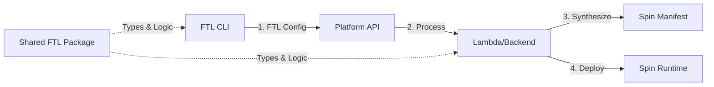

# FTL Platform Backend Integration Guide

## Executive Summary

This document provides complete technical specifications for integrating the FTL platform backend with the new Go-based deployment system. The backend will receive FTL application configurations directly from the CLI and synthesize Spin manifests server-side using shared Go packages, ensuring perfect consistency between CLI and platform.

## Architecture Overview



### Key Architectural Decisions

1. **Contract**: The API accepts FTL application configuration (not Spin manifests)
2. **Synthesis**: Platform synthesizes Spin manifests server-side using CUE
3. **Consistency**: Both CLI and backend use the same shared Go package
4. **Registry**: Components are pre-pushed to ECR, platform assembles from registry references

## Shared Package Integration

### Installation

Add to your Lambda's `go.mod`:

```go
require github.com/fastertools/ftl-cli/go/shared/ftl v0.1.0

// For local development, use replace directive:
// replace github.com/fastertools/ftl-cli/go/shared/ftl => ./path/to/ftl-cli/go/shared/ftl
```

### Package Structure

```
github.com/fastertools/ftl-cli/go/shared/ftl/
├── types.go          # Core FTL types (Application, Component, etc.)
├── synthesis.go      # CUE-based transformation to Spin manifests
├── deployment.go     # Deployment request/response contracts
├── patterns.cue      # Embedded CUE transformation patterns
└── README.md         # Package documentation
```

## API Contract

### POST /apps/{app-id}/deployments

#### Request Body Schema

```go
type DeploymentRequest struct {
    // The FTL application configuration
    Application *Application `json:"application"`
    
    // Environment-specific variables
    Variables map[string]string `json:"variables,omitempty"`
    
    // Environment name (e.g., production, staging)
    Environment string `json:"environment,omitempty"`
    
    // Access control override (if different from app config)
    AccessControl *AccessMode `json:"access_control,omitempty"`
    
    // Custom auth configuration (for custom access mode)
    CustomAuth *CustomAuthConfig `json:"custom_auth,omitempty"`
    
    // Allowed roles for org access mode
    AllowedRoles []string `json:"allowed_roles,omitempty"`
}

type Application struct {
    Name        string      `json:"name"`
    Version     string      `json:"version,omitempty"`
    Description string      `json:"description,omitempty"`
    Components  []Component `json:"components,omitempty"`
    Access      AccessMode  `json:"access,omitempty"`
    Auth        AuthConfig  `json:"auth,omitempty"`
}

type Component struct {
    ID        string            `json:"id"`
    Source    ComponentSource   `json:"source"`  // Can be string (local) or RegistrySource
    Build     *BuildConfig      `json:"build,omitempty"`
    Variables map[string]string `json:"variables,omitempty"`
}

// ComponentSource is an interface - in JSON it's either:
// - A string: "./dist/component.wasm" (local path, pre-deployment)
// - An object: {"registry": "...", "package": "...", "version": "..."} (registry ref)

type RegistrySource struct {
    Registry string `json:"registry"`  // e.g., "123456.dkr.ecr.us-west-2.amazonaws.com/app-id"
    Package  string `json:"package"`   // e.g., "app-id:component-name"
    Version  string `json:"version"`   // e.g., "1.0.0"
}

type AccessMode string // "public" | "private" | "org" | "custom"

type AuthConfig struct {
    Provider    string `json:"provider"`      // "workos" | "custom"
    OrgID       string `json:"org_id,omitempty"`
    JWTIssuer   string `json:"jwt_issuer,omitempty"`
    JWTAudience string `json:"jwt_audience,omitempty"`
}
```

#### Example Request

```json
{
  "application": {
    "name": "weather-assistant",
    "version": "1.0.0",
    "description": "Weather information MCP tool",
    "components": [
      {
        "id": "weather-api",
        "source": {
          "registry": "123456.dkr.ecr.us-west-2.amazonaws.com/app-abc123",
          "package": "app-abc123:weather-api",
          "version": "1.0.0"
        },
        "variables": {
          "API_KEY": "{{weather_api_key}}"
        }
      }
    ],
    "access": "private",
    "auth": {
      "provider": "workos",
      "org_id": "org_123456",
      "jwt_issuer": "https://api.workos.com"
    }
  },
  "variables": {
    "weather_api_key": "secret-key-123"
  },
  "environment": "production"
}
```

#### Response Schema

```go
type DeploymentResponse struct {
    DeploymentID string `json:"deployment_id"`
    AppID        string `json:"app_id"`
    AppName      string `json:"app_name"`
    Status       string `json:"status"`       // "pending" | "active" | "failed"
    Message      string `json:"message,omitempty"`
}
```

## Backend Implementation

### Complete Lambda Handler Example

```go
package main

import (
    "context"
    "encoding/json"
    "fmt"
    "log"
    "os"
    
    "github.com/aws/aws-lambda-go/events"
    "github.com/aws/aws-lambda-go/lambda"
    "github.com/aws/aws-sdk-go/aws"
    "github.com/aws/aws-sdk-go/aws/session"
    "github.com/aws/aws-sdk-go/service/s3"
    "github.com/google/uuid"
    
    "github.com/fastertools/ftl-cli/go/shared/ftl"
)

var (
    s3Client *s3.S3
    spinDeploymentBucket = os.Getenv("SPIN_DEPLOYMENT_BUCKET")
)

func init() {
    sess := session.Must(session.NewSession())
    s3Client = s3.New(sess)
}

func handleCreateDeployment(ctx context.Context, request events.APIGatewayProxyRequest) (events.APIGatewayProxyResponse, error) {
    // Extract app ID from path
    appID := request.PathParameters["app-id"]
    if appID == "" {
        return errorResponse(400, "app-id is required"), nil
    }
    
    // Parse deployment request using shared types
    var deployReq ftl.DeploymentRequest
    if err := json.Unmarshal([]byte(request.Body), &deployReq); err != nil {
        log.Printf("Failed to parse request: %v", err)
        return errorResponse(400, fmt.Sprintf("Invalid request body: %v", err)), nil
    }
    
    // Validate the application configuration
    if err := deployReq.Application.Validate(); err != nil {
        log.Printf("Invalid application: %v", err)
        return errorResponse(400, fmt.Sprintf("Invalid application configuration: %v", err)), nil
    }
    
    // Ensure all components have registry sources (not local paths)
    for _, comp := range deployReq.Application.Components {
        if comp.Source.IsLocal() {
            return errorResponse(400, fmt.Sprintf("Component %s has local source, must be pushed to registry first", comp.ID)), nil
        }
    }
    
    // Process the deployment request to generate Spin manifest
    manifest, err := ftl.ProcessDeploymentRequest(&deployReq)
    if err != nil {
        log.Printf("Failed to process deployment: %v", err)
        return errorResponse(500, fmt.Sprintf("Failed to process deployment: %v", err)), nil
    }
    
    // Convert manifest to TOML for Spin
    synth := ftl.NewSynthesizer()
    tomlManifest, err := synth.SynthesizeToTOML(deployReq.Application)
    if err != nil {
        log.Printf("Failed to synthesize TOML: %v", err)
        return errorResponse(500, "Failed to generate Spin manifest"), nil
    }
    
    // Generate deployment ID
    deploymentID := fmt.Sprintf("dep_%s", uuid.New().String())
    
    // Store manifest in S3 for Spin deployment
    manifestKey := fmt.Sprintf("deployments/%s/%s/spin.toml", appID, deploymentID)
    if err := storeManifestInS3(manifestKey, tomlManifest); err != nil {
        log.Printf("Failed to store manifest: %v", err)
        return errorResponse(500, "Failed to store deployment manifest"), nil
    }
    
    // Store deployment metadata in DynamoDB
    if err := storeDeploymentMetadata(deploymentID, appID, deployReq); err != nil {
        log.Printf("Failed to store metadata: %v", err)
        return errorResponse(500, "Failed to store deployment metadata"), nil
    }
    
    // Trigger Spin deployment (via SQS, Step Functions, or direct API)
    if err := triggerSpinDeployment(deploymentID, appID, manifestKey); err != nil {
        log.Printf("Failed to trigger deployment: %v", err)
        return errorResponse(500, "Failed to trigger deployment"), nil
    }
    
    // Return deployment response
    response := ftl.DeploymentResponse{
        DeploymentID: deploymentID,
        AppID:        appID,
        AppName:      deployReq.Application.Name,
        Status:       "pending",
        Message:      "Deployment initiated successfully",
    }
    
    respBody, _ := json.Marshal(response)
    return events.APIGatewayProxyResponse{
        StatusCode: 202,
        Headers: map[string]string{
            "Content-Type": "application/json",
        },
        Body: string(respBody),
    }, nil
}

func storeManifestInS3(key string, manifest string) error {
    _, err := s3Client.PutObject(&s3.PutObjectInput{
        Bucket: aws.String(spinDeploymentBucket),
        Key:    aws.String(key),
        Body:   aws.ReadSeekCloser(strings.NewReader(manifest)),
        ContentType: aws.String("text/plain"),
        Metadata: map[string]*string{
            "deployment-type": aws.String("ftl"),
        },
    })
    return err
}

func storeDeploymentMetadata(deploymentID, appID string, req ftl.DeploymentRequest) error {
    // Store in DynamoDB
    // Implementation depends on your database schema
    log.Printf("Storing deployment %s for app %s", deploymentID, appID)
    return nil
}

func triggerSpinDeployment(deploymentID, appID, manifestKey string) error {
    // Trigger deployment via your preferred method:
    // - SQS message to deployment worker
    // - Step Functions execution
    // - Direct Spin API call
    log.Printf("Triggering deployment %s for app %s with manifest %s", deploymentID, appID, manifestKey)
    return nil
}

func errorResponse(code int, message string) events.APIGatewayProxyResponse {
    return events.APIGatewayProxyResponse{
        StatusCode: code,
        Headers: map[string]string{
            "Content-Type": "application/json",
        },
        Body: fmt.Sprintf(`{"error": "%s"}`, message),
    }
}

func main() {
    lambda.Start(handleCreateDeployment)
}
```

### Synthesis-Only Endpoint (Optional, for Testing)

```go
// POST /synthesize
// Accepts FTL Application, returns Spin manifest for validation/debugging

func handleSynthesize(ctx context.Context, request events.APIGatewayProxyRequest) (events.APIGatewayProxyResponse, error) {
    var app ftl.Application
    if err := json.Unmarshal([]byte(request.Body), &app); err != nil {
        return errorResponse(400, "Invalid application configuration"), nil
    }
    
    // Set defaults and validate
    app.SetDefaults()
    if err := app.Validate(); err != nil {
        return errorResponse(400, fmt.Sprintf("Invalid application: %v", err)), nil
    }
    
    // Synthesize to Spin manifest
    synth := ftl.NewSynthesizer()
    manifest, err := synth.SynthesizeToSpin(&app)
    if err != nil {
        return errorResponse(400, fmt.Sprintf("Synthesis failed: %v", err)), nil
    }
    
    // Return manifest as JSON
    respBody, _ := json.Marshal(manifest)
    return events.APIGatewayProxyResponse{
        StatusCode: 200,
        Headers: map[string]string{
            "Content-Type": "application/json",
        },
        Body: string(respBody),
    }, nil
}
```

## Key Implementation Notes

### 1. Component Registry References

All components in the deployment request MUST have registry references, not local paths:

```go
// ❌ INVALID - Local path (pre-push)
{
    "id": "my-tool",
    "source": "./dist/my-tool.wasm"
}

// ✅ VALID - Registry reference (post-push)
{
    "id": "my-tool",
    "source": {
        "registry": "123456.dkr.ecr.us-west-2.amazonaws.com/app-abc123",
        "package": "app-abc123:my-tool",
        "version": "1.0.0"
    }
}
```

### 2. MCP Components

The synthesis automatically adds MCP gateway and authorizer components:

```go
// These are added automatically by synthesis:
// - ftl-mcp-gateway (always)
// - mcp-authorizer (when access != "public")
```

### 3. Authentication Modes

```go
switch app.Access {
case "public":
    // No auth, gateway only
case "private":
    // WorkOS auth with user's org
case "org":
    // WorkOS auth with specific org roles
case "custom":
    // Custom JWT issuer/audience
}
```

### 4. Variable Substitution

Variables from the deployment request should be applied to the manifest:

```go
// From request.Variables
"weather_api_key": "secret-123"

// Applied to component variables in manifest
component.Variables["API_KEY"] = "secret-123"
```

## Testing the Integration

### 1. Unit Test Example

```go
func TestDeploymentProcessing(t *testing.T) {
    req := ftl.DeploymentRequest{
        Application: &ftl.Application{
            Name:    "test-app",
            Version: "1.0.0",
            Components: []ftl.Component{
                {
                    ID: "api",
                    Source: &ftl.RegistrySource{
                        Registry: "test.registry.com",
                        Package:  "test:api",
                        Version:  "1.0.0",
                    },
                },
            },
            Access: ftl.AccessPrivate,
        },
    }
    
    manifest, err := ftl.ProcessDeploymentRequest(&req)
    assert.NoError(t, err)
    assert.NotNil(t, manifest)
    
    // Should have MCP components
    assert.Contains(t, manifest.Component, "ftl-mcp-gateway")
    assert.Contains(t, manifest.Component, "mcp-authorizer")
    
    // Should have user component
    assert.Contains(t, manifest.Component, "api")
}
```

### 2. Integration Test Flow

```bash
# 1. CLI builds and pushes component
ftl build
spin deps publish --registry $ECR_URI --package app-123:my-tool@1.0.0 ./dist/my-tool.wasm

# 2. CLI sends deployment request
curl -X POST https://api.ftl.dev/apps/app-123/deployments \
  -H "Authorization: Bearer $TOKEN" \
  -H "Content-Type: application/json" \
  -d '{
    "application": {
      "name": "my-app",
      "components": [{
        "id": "my-tool",
        "source": {
          "registry": "'$ECR_URI'",
          "package": "app-123:my-tool",
          "version": "1.0.0"
        }
      }]
    }
  }'

# 3. Backend synthesizes and deploys
# - Generates spin.toml
# - Deploys to Spin runtime
# - Returns deployment ID
```

## Migration Checklist

- [ ] Add `github.com/fastertools/ftl-cli/go/shared/ftl` dependency
- [ ] Replace existing deployment request types with `ftl.DeploymentRequest`
- [ ] Implement `ProcessDeploymentRequest()` for synthesis
- [ ] Update API endpoint to accept FTL application schema
- [ ] Store synthesized manifests (S3/database)
- [ ] Update deployment pipeline to use synthesized manifests
- [ ] Add validation for registry-only components
- [ ] Implement deployment status tracking
- [ ] Add synthesis endpoint for testing (optional)
- [ ] Update monitoring/logging for new format

## Troubleshooting

### Common Issues

1. **"Component has local source"**
   - Components must be pushed to registry before deployment
   - CLI handles this, but validate on backend

2. **"Failed to synthesize"**
   - Check CUE patterns are embedded correctly
   - Validate application structure matches schema

3. **"Invalid access mode"**
   - Must be one of: public, private, org, custom
   - Custom requires JWT issuer/audience

4. **Component version mismatch**
   - Ensure registry references match pushed components
   - Version in manifest must match registry tag

## Support

For questions or issues:
- Shared package issues: Create issue in ftl-cli repository
- Backend integration: Contact platform team
- CUE synthesis: Check embedded patterns.cue

## Appendix: Full Type Definitions

See `/go/shared/ftl/types.go` for complete type definitions and validation logic.

## Next Steps

1. **Immediate**: Update deployment API to accept new schema
2. **Short-term**: Implement synthesis and manifest storage
3. **Medium-term**: Add deployment status webhook
4. **Long-term**: Support incremental deployments and rollbacks